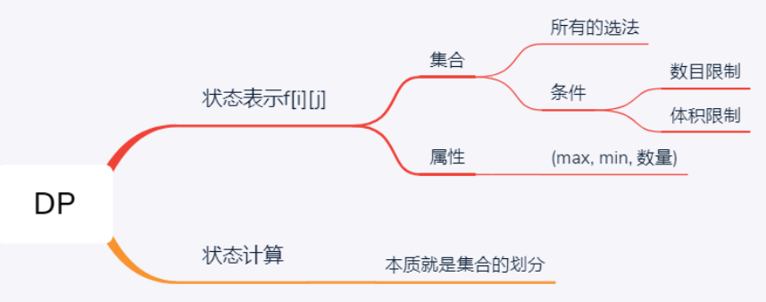

## 题目
有 N 件物品和一个容量是 V 的背包。每件物品只能使用一次。

第 i 件物品的体积是 $v_i$，价值是 $w_i$。

求解将哪些物品装入背包，可使这些物品的总体积不超过背包容量，且总价值最大。
输出最大价值。

## 输入格式
第一行两个整数，N，V，用空格隔开，分别表示物品数量和背包容积。

接下来有 N 行，每行两个整数 $v_i,w_i$，用空格隔开，分别表示第 i 件物品的体积和价值。

## 输出格式
输出一个整数，表示最大价值。

## 数据范围
$0<N,V≤1000$
$0<v_i,w_i≤1000$

## 样例
```c++
输入样例
4 5
1 2
2 4
3 4
4 5
输出样例：
8
```

## 分析

### 版本1 二维
（1）状态`f[i][j]`定义：前 `i` 个物品，背包容量 `j` 下的最优解（最大价值）：

当前的状态依赖于之前的状态，可以理解为从初始状态`f[0][0] = 0`开始决策，有 `N` 件物品，则需要 `N` 次决 策，每一次对第 `i` 件物品的决策，状态`f[i][j]`不断由之前的状态更新而来。
（2）当前背包容量不够（`j < v[i]`），没得选，因此前 `i` 个物品最优解即为前 `i−1` 个物品最优解：

对应代码：`f[i][j] = f[i - 1][j]`。
（3）当前背包容量够，可以选，因此需要决策选与不选第 `i` 个物品：

选：`f[i][j] = f[i - 1][j - v[i]] + w[i]`
不选：`f[i][j] = f[i - 1][j]` 。
我们的决策是如何取到最大价值，因此以上两种情况取 `max()` 。
代码如下：
```c++
#include<bits/stdc++.h>

using namespace std;

const int MAXN = 1005;
int v[MAXN];    // 体积
int w[MAXN];    // 价值 
int f[MAXN][MAXN];  // f[i][j], j体积下前i个物品的最大价值 

int main() 
{
    int n, m;   
    cin >> n >> m;
    for(int i = 1; i <= n; i++) 
        cin >> v[i] >> w[i];

    for(int i = 1; i <= n; i++) 
        for(int j = 1; j <= m; j++)
        {
            //  当前背包容量装不进第i个物品，则价值等于前i-1个物品
            if(j < v[i]) 
                f[i][j] = f[i - 1][j];
            // 能装，需进行决策是否选择第i个物品
            else    
                f[i][j] = max(f[i - 1][j], f[i - 1][j - v[i]] + w[i]);
        }           

    cout << f[n][m] << endl;

    return 0;
}
```

### 版本2 一维
将状态`f[i][j]`优化到一维`f[j]`，实际上只需要做一个等价变形。

为什么可以这样变形呢？我们定义的状态`f[i][j]`可以求得任意合法的i与j最优解，但题目只需要求得最终状态`f[n][m]`，因此我们只需要一维的空间来更新状态。

（1）状态`f[j]`定义：`N` 件物品，背包容量`j`下的最优解。

（2）注意枚举背包容量`j`必须从`m`开始。

（3）为什么一维情况下枚举背包容量需要逆序？在二维情况下，状态`f[i][j]`是由上一轮`i - 1`的状态得来的，`f[i][j]`与`f[i - 1][j]`是独立的。而优化到一维后，如果我们还是正序，则有`f[较小体积]`更新到`f[较大体积]`，则有可能本应该用第`i-1`轮的状态却用的是第`i`轮的状态。

（4）例如，一维状态第`i`轮对体积为 `3` 的物品进行决策，则`f[7]`由f`[4]`更新而来，这里的`f[4]`正确应该是`f[i - 1][4]`，但从小到大枚举`j`这里的`f[4]`在第i轮计算却变成了`f[i][4]`。当逆序枚举背包容量`j`时，我们求`f[7]`同样由`f[4]`更新，但由于是逆序，这里的`f[4]`还没有在第i轮计算，所以此时实际计算的`f[4]`仍然是`f[i - 1][4]`。

（5）简单来说，一维情况正序更新状态`f[j]`需要用到前面计算的状态已经被`「污染」`，逆序则不会有这样的问题。

状态转移方程为：`f[j] = max(f[j], f[j - v[i]] + w[i]` 。
```c++
for(int i = 1; i <= n; i++) 
    for(int j = m; j >= 0; j--)
    {
        if(j < v[i]) 
            f[i][j] = f[i - 1][j];  // 优化前
            f[j] = f[j];            // 优化后，该行自动成立，可省略。
        else    
            f[i][j] = max(f[i - 1][j], f[i - 1][j - v[i]] + w[i]);  // 优化前
            f[j] = max(f[j], f[j - v[i]] + w[i]);                   // 优化后
    } 
```   
实际上，只有当`枚举的背包容量 >= v[i]` 时才会更新状态，因此我们可以修改循环终止条件进一步优化。
```c++
for(int i = 1; i <= n; i++)
{
    for(int j = m; j >= v[i]; j--)  
        f[j] = max(f[j], f[j - v[i]] + w[i]);
} 
```
* 关于状态`f[j]`的补充说明
二维下的状态定义`f[i][j]`是前 i 件物品，背包容量 `j` 下的最大价值。一维下，少了前 `i` 件物品这个维度，我们的代码中决策到第 `i` 件物品（循环到第`i`轮），`f[j]`就是前i轮已经决策的物品且背包容量 `j` 下的最大价值。

因此当执行完循环结构后，由于已经决策了所有物品，`f[j]`就是所有物品背包容量 `j` 下的最大价值。即一维`f[j]`等价于二维`f[n][j]`。

### 版本3 优化输入
我们注意到在处理数据时，我们是一个物品一个物品，一个一个体积的枚举。

因此我们可以不必开两个数组记录体积和价值，而是边输入边处理。
```c++
#include<bits/stdc++.h>

using namespace std;

const int MAXN = 1005;
int f[MAXN];  // 

int main() 
{
    int n, m;   
    cin >> n >> m;

    for(int i = 1; i <= n; i++) {
        int v, w;
        cin >> v >> w;      // 边输入边处理
        for(int j = m; j >= v; j--)
            f[j] = max(f[j], f[j - v] + w);
    }

    cout << f[m] << endl;

    return 0;
}
```

## 解答
```c++
#include"bits/stdc++.h"

using namespace std;

const int N = 1010;

int n;//所有物品的数量
int m;//背包的容量
int v[N];//第i个物品的体积
int w[N];//第i个物品的价值
//int f[N][N];//f[i][j]:存放i件物品总体积不超过j的最大价值
int f[N];//总体积不超过j的最大价值

int main()
{
    cin>>n>>m;
    
    for (int i = 1; i <= n; i ++ ) 
        cin>>v[i]>>w[i];
    
    //原始
    // for (int i = 1; i <= n; i ++ )
    //     for (int j = 0; j <= m; j ++ )
    //     {
    //         f[i][j]=f[i-1][j];
    //         if(j>=v[i]) 
    //             f[i][j]=max(f[i][j],f[i-1][j-v[i]]+w[i]);
    //     }
    
    //化简:
    for (int i = 1; i <= n; i ++ )
        for (int j = m; j >= v[i]; j -- )
        {
            f[j]=max(f[j],f[j-v[i]]+w[i]);
        }
    
    //cout<<f[n][m]<<endl;
    cout<<f[m]<<endl;
    return 0;
}
```