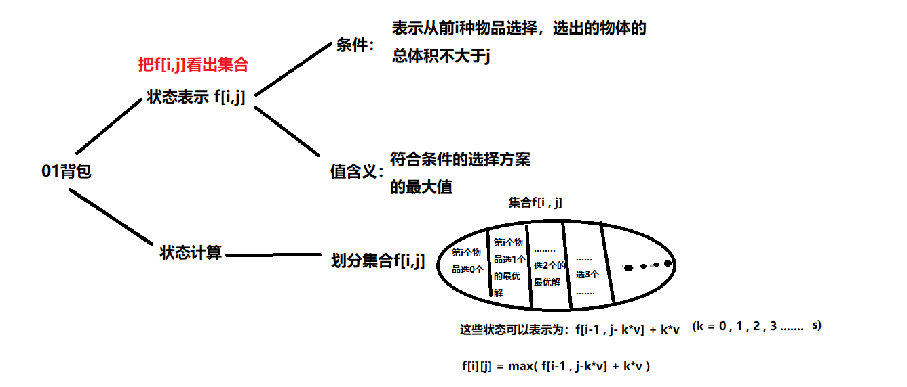

## 题目
有 N 种物品和一个容量是 V 的背包。

第 i 种物品最多有 $s_i$ 件，每件体积是 $v_i$，价值是 $w_i$。

求解将哪些物品装入背包，可使物品体积总和不超过背包容量，且价值总和最大。
输出最大价值。

## 输入格式
第一行两个整数，N，V，用空格隔开，分别表示物品种数和背包容积。

接下来有 N 行，每行三个整数 $v_i$,$w_i$,$s_i$，用空格隔开，分别表示第 i 种物品的体积、价值和数量。

## 输出格式
输出一个整数，表示最大价值。

## 数据范围
$0<N≤1000$
$0≤V≤2000$
$0<v_i,w_i,s_i≤200$

**提示**：
本题考查多重背包的二进制优化方法。

## 样例
```c++
输入样例
4 5
1 2 3
2 4 1
3 4 3
4 5 2
输出样例：
10
```

## 分析
### 基本思考框架


思路和`多重背包问题I`一样，但这题的数据范围变成`1000`了，非优化写法时间复杂度$O(n^3)$ 接近 `1e9`
必超时。

### 优化多重背包的优化
首先，我们不能用完全背包的优化思路来优化这个问题，因为每组的物品的个数都不一样，是不能像之前一样推导不优化递推关系的。

**我们列举一下更新次序的内部关系**：

`f[i , j ] = max( f[i-1,j] , f[i-1,j-v]+w , f[i-1,j-2v]+2w , f[i-1,j-3v]+3w , ... , f[i-1][j-sv]+sw)`
`f[i , j-v]= max( f[i-1,j-v] , f[i-1,j-2v] + w , f[i-1,j-3v]+2*w , ... , f[i-1][j-sv]+(s-1)w+f[i-1][j-(s+1)v]+sw)`

接下来，我介绍一个二进制优化的方法，假设有一组商品，一共有11个。我们知道，十进制数字 11 可以这样表示
`11=1011(B)=0111(B)+(11−0111(B))=0111(B)+0100(B)`

正常背包的思路下，我们要求出含这组商品的最优解，我们要枚举`12`次（枚举装`0，1，2....12`个）。

现在，如果我们把这`11`个商品分别打包成含商品个数为`1个，2个，4个，4个`（分别对应`0001,0010,0100,0100`）的四个”新的商品 “, 将问题转化为01背包问题，对于每个商品，我们都只枚举一次，那么我们只需要枚举四次 ，就可以找出这含组商品的最优解。 这样就大大减少了枚举次数。

这种优化对于大数尤其明显，例如有1024个商品，在正常情况下要枚举1025次 ， 二进制思想下转化成01背包只需要枚举10次。

**优化的合理性的证明**
先讲结论：上面的`1，2，4，4`是可以通过组合来表示出`0~11`中任何一个数的，还是拿`11`证明一下（举例一下）：

首先，11可以这样分成两个二进制数的组合：
`11=0111(B)+(11−0111(B))=0111(B)+0100(B)`

其中`0111`通过枚举这三个`1`的取或不取（也就是对`0001(B)`，`0010(B)`，`0100(B)`的组合），可以表示十进制数`0~7`( 刚好对应了 `1，2，4` 可以组合出 `0~7` ) , `0~7`的枚举再组合上`0100(B)`( 即 十进制的 `4` ) ，可以表示十进制数 `0~11`。其它情况也可以这样证明。这也是为什么，这个完全背包问题可以等效转化为01背包问题，有木有觉得很奇妙

怎么合理划分一个十进制数?
上面我把11划分为

`11=0111(B)+(11−0111(B))=0111(B)+0100(B)`

是因为 `0111(B)`刚好是小于`11`的最大的尾部全为1的二进制 ( 按照上面的证明，这样的划分没毛病 ) , 然后那个尾部全为1的数又可以 分解为` 0000....1` , `0000....10` , `0000....100` 等等。

对应c++代码：
```c++
//设有s个商品，也就是将s划分
for(int k = 1 ; k <= s ;k*=2)
{
    s-=k;
    goods.push_back({v*k,w*k});
}
if(s>0) 
    goods.push_back({v*s,w*s});
```

## 体会
1. 1加上多个2的倍数一定能凑出一个奇数
2. 多个2的倍数一定能凑出一个偶数
-  $1,2,4,8,···,2^k,c$
   $c<2^{k+1}$
   =>  任何一个大于0的数都可以用$`多个2的倍数的数+c`凑得

## 解答
```c++
#include <iostream>
#include <cstring>
#include <algorithm>

using namespace std;

const int N = 12010;
//S数量分组会产生logS组,把每一组看成一个物品就出现了N*logS个,1000*12=12000
const int M=2010;

int n,m;
int v[N],w[N];
int f[M];

int main()
{
    cin>>n>>m;
    
    int cnt=0;
    for (int i = 1; i <= n; i ++ )
    {
        int a,b,s;
        cin>>a>>b>>s;
        
        int k=1;
        while(k<=s){
            cnt++;
            v[cnt]=a*k;
            w[cnt]=b*k;
            s-=k;
            k*=2;
        }
        if(s>0){
            cnt++;
            v[cnt]=a*s;
            w[cnt]=b*s;
        }
    }
    
    n=cnt;
        
    for (int i = 1; i <= n; i ++ )
        for (int j = m; j >= v[i]; j -- )
            f[j]=max(f[j],f[j-v[i]]+w[i]);
                
    cout<<f[m]<<endl;
    return 0;
}
```