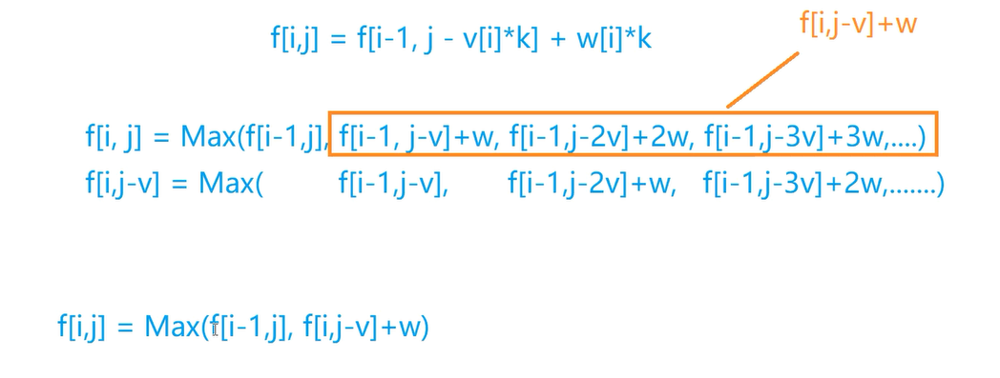

## 题目
有 N 组物品和一个容量是 V 的背包。

每组物品有若干个，同一组内的物品最多只能选一个。
每件物品的体积是 $v_{ij}$，价值是 $w_{ij}$，其中 `i` 是组号，`j` 是组内编号。

求解将哪些物品装入背包，可使物品总体积不超过背包容量，且总价值最大。

输出最大价值。

## 输入格式
第一行有两个整数 N，V，用空格隔开，分别表示物品组数和背包容量。

接下来有 N 组数据：

每组数据第一行有一个整数 $S_i$，表示第 i 个物品组的物品数量；
每组数据接下来有 $S_i$ 行，每行有两个整数 $v_{ij}$,$w_{ij}$，用空格隔开，分别表示第 i 个物品组的第 j 个物品的体积和价值；

## 输出格式
输出一个整数，表示最大价值。

## 数据范围
$0<N,V≤100$
$0<S_i≤100$
$0<v_{ij},w_{ij}≤100$

## 样例
```c++
输入样例
3 5
2
1 2
2 4
1
3 4
1
4 5
输出样例：
8
```

## 分析



## 解答
```c++
#include <iostream>
#include <cstring>
#include <algorithm>

using namespace std;

const int N = 110;

int n,m;
int v[N][N];//v[i][j]:第i组的第j个物品的体积
int w[N][N];//w[i][j]:第i组的第j个物品的价值
int s[N];//s[j]:第j组的物品数量
int f[N];//f[j]:背包容量为j的的背包存放的最大价值

int main()
{
    cin>>n>>m;
    
    for (int i = 1; i <= n; i ++ ){
        cin>>s[i];
        for (int j = 1; j <= s[i]; j ++ )
            cin>>v[i][j]>>w[i][j];
    }
    
    for (int i = 1; i <= n; i ++ )
        for (int j = m; j >= 0; j -- )
            for (int k = 1; k <= s[i]; k ++ )
                if(v[i][k]<=j)
                    f[j]=max(f[j],f[j-v[i][k]]+w[i][k]);
                    
    cout<<f[m]<<endl;

    return 0; 
}
```