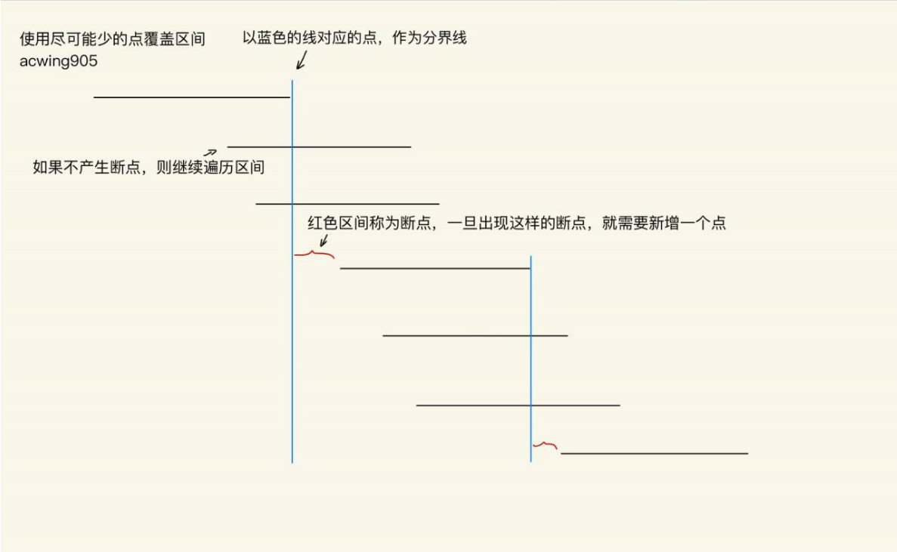

## 题目
给定 N 个闭区间 $[a_i,b_i]$，请你在数轴上选择尽量少的点，使得每个区间内至少包含一个选出的点。

输出选择的点的最小数量。

位于区间端点上的点也算作区间内。

## 输入格式
第一行包含整数 N，表示区间数。

接下来 N 行，每行包含两个整数 $a_i,b_i$，表示一个区间的两个端点。

## 输出格式
输出一个整数，表示所需的点的最小数量。

## 数据范围
$1≤N≤10^5$,
$−10^9≤a_i≤b_i≤10^9$

## 样例
```c++
输入样例：
3
-1 1
2 4
3 5
输出样例：
2
```

## 分析

```c++
其实可以看成把相连的区间合并之后的区间数量
贪心:把区间从左到右排列,当前区间最有希望和下一个区间相交的点就是右端点了
1. 将每个区间按右端点从小到大排序
2. 从前往后依次枚举每个区间
    如果当前区间中包含点，则直接pass
    否则，选择当前区间的右端点
```

## 解答
```c++
#include <iostream>
#include <cstring>
#include <algorithm>

using namespace std;

typedef pair<int, int> PII;

const int N = 1e5+10;

PII q[N];
int n;

bool cmp(PII a,PII b)
{
    return a.second<b.second;
}

int main()
{
    cin>>n;
    for (int i = 0; i < n; i ++ )
    {
        int l,r;
        cin>>l>>r;
        q[i]={l,r};
    }
    
    sort(q,q+n,cmp);
    
    int ans=0;
    int p=-(1e9+10);
    for (int i = 0; i < n; i ++ )
        if(q[i].first>p)
        {
            ans++;
            p=q[i].second;
        }
    
    cout<<ans<<endl;
    
    return 0;
}

```