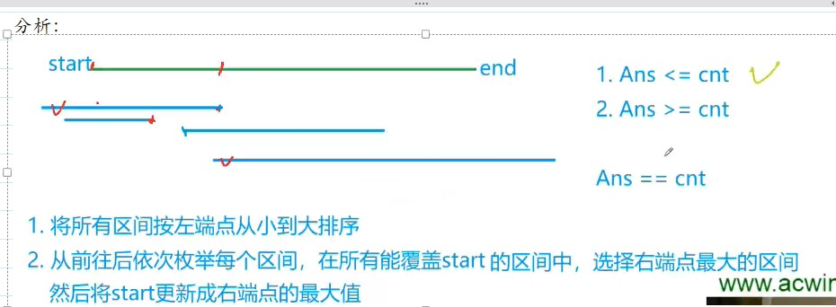

## 题目
给定 N 个闭区间 $[a_i,b_i]$ 以及一个线段区间 `[s,t]`，请你选择尽量少的区间，将指定线段区间完全覆盖。

输出最少区间数，如果无法完全覆盖则输出 −1。

## 输入格式
第一行包含两个整数 `s` 和 `t`，表示给定线段区间的两个端点。

第二行包含整数 N，表示给定区间数。

接下来 N 行，每行包含两个整数 $a_i,b_i$，表示一个区间的两个端点。

## 输出格式
输出一个整数，表示所需最少区间数。

如果无解，则输出 −1。

## 数据范围
$1≤N≤10^5$,
$−10^9≤a_i≤b_i≤10^9$,
$−10^9≤s≤t≤10^9$

## 样例
```c++
输入样例：
1 5
3
-1 3
2 4
3 5
输出样例：
2
```

## 分析

```c++
思路：
1.排序
2.从前往后一次枚举每个区间：判断左端点在st之前的区间，循环找到最大右端点，如果右端点也在st之前，说明无法覆盖。下一次枚举的时候依旧用这个区间(i不变)。
3.如果找到左端点在st之前，右端点在st之后的区间，(i++)
4.每循环一次，没有在前面跳出的话，说明找到了一个区间，res++
5.如果这个区间右端点能覆盖end，说明能覆
6.把start更新成right，保证后面的区间适合之前的区间有交集，从而形成对整个序列的覆盖
7。如果遍历了所有的数组，还是没有覆盖最后的end，说明不能成功
```
```c++
问题
Question1:为什么要用双指针？
Answer:不用双指针也可以，直接用i就行

Question2:为什么right不在循环外面？
Answer:right必须要在循环内部定义， 每次更新完右端点后，
       right要设为最小值，否则会把上一次的区间也算进去，
       这样就不会存在right < st的情况，因为在上一次情况中right = st。
```

## 解答
```c++
#include <iostream>
#include <cstring>
#include <algorithm>

using namespace std;

const int N = 1e5+10;
int n,s,t;

struct Range{
    int l,r;
    bool operator<(const Range &range) const
    {
        return l<range.l;
    }
}range[N];

int main()
{
    cin>>s>>t;
    
    cin>>n;
    for (int i = 0; i < n; i ++ )
    {
        int l,r;
        cin>>l>>r;
        range[i]={l,r};
    }
    
    sort(range,range+n);
    
    int ans=0;
    bool flag=false;
    for (int i = 0; i < n; i ++ )
    {
        int j=i,k=-1e9;
        while(j<n&&range[j].l<=s){
            k=max(k,range[j].r);
            j++;
        }
        if(k<s){
            ans=-1;
            break;
        }
        
        ans++;
        
        if(k>=t){
            flag=true;
            break;
        } 
        
        s=k;
        i=j-1;
    }
    
    if (!flag) ans = -1;
    printf("%d\n", ans);
        
    return 0;
}

```