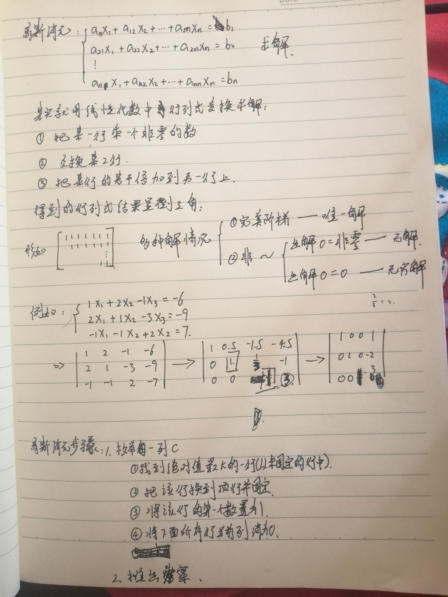

## 题目
输入一个包含 n 个方程 n 个未知数的线性方程组。

方程组中的系数为实数。

求解这个方程组。

下图为一个包含 m 个方程 n 个未知数的线性方程组示例：


## 输入格式
第一行包含整数 n。

接下来 n 行，每行包含 `n+1` 个实数，表示一个方程的 n 个系数以及等号右侧的常数。

## 输出格式
如果给定线性方程组存在唯一解，则输出共 n 行，其中第 i 行输出第 i 个未知数的解，结果保留两位小数。

如果给定线性方程组存在无数解，则输出 `Infinite group solutions`。

如果给定线性方程组无解，则输出 `No solution。`

## 数据范围
$1≤n≤100$,
所有输入系数以及常数均保留两位小数，绝对值均不超过 100。

## 样例
```c++
输入样例：
3
1.00 2.00 -1.00 -6.00
2.00 1.00 -3.00 -9.00
-1.00 -1.00 2.00 7.00
输出样例：
1.00
-2.00
3.00
```

## 分析


## 模板
```c++
// a[N][N]是增广矩阵
int gauss()
{
    int c, r;
    for (c = 0, r = 0; c < n; c ++ )
    {
        int t = r;
        for (int i = r; i < n; i ++ )   // 找到绝对值最大的行
            if (fabs(a[i][c]) > fabs(a[t][c]))
                t = i;

        if (fabs(a[t][c]) < eps) continue;

        for (int i = c; i <= n; i ++ ) swap(a[t][i], a[r][i]);      // 将绝对值最大的行换到最顶端
        for (int i = n; i >= c; i -- ) a[r][i] /= a[r][c];      // 将当前行的首位变成1
        for (int i = r + 1; i < n; i ++ )       // 用当前行将下面所有的列消成0
            if (fabs(a[i][c]) > eps)
                for (int j = n; j >= c; j -- )
                    a[i][j] -= a[r][j] * a[i][c];

        r ++ ;
    }

    if (r < n)
    {
        for (int i = r; i < n; i ++ )
            if (fabs(a[i][n]) > eps)
                return 2; // 无解
        return 1; // 有无穷多组解
    }

    for (int i = n - 1; i >= 0; i -- )
        for (int j = i + 1; j < n; j ++ )
            a[i][n] -= a[i][j] * a[j][n];

    return 0; // 有唯一解
}
```

## 解答
```c++
#include <iostream>
#include <cstring>
#include <algorithm>
#include <cmath>

using namespace std;

const int N = 110; 
const double eps = 1e-8;

double a[N][N];
int n;

int gauss()
{
    int c,r;
    for(c=0,r=0;c<n;c++)//枚举每一列
    {
        int t=r;
        for (int i = r; i < n; i ++ )//从没固定的行中找到绝对值最大的一行
            if(fabs(a[i][c])>fabs(a[t][c]))
                t=i;
        
        if(fabs(a[t][c])<eps) continue; //如果这一列中绝对值最大的是0的话，就达成最终目标了，不用计算这一列了
        
        for(int i=c;i<n+1;i++) swap(a[t][i],a[r][i]);//把这行变成顶行
        for(int i=n;i>=c;i--) a[r][i]/=a[r][c];//把第一个非零列变成1
        
        for(int i=r+1;i<n;i++)//把第r行下面行当前列全部消为0
            if(fabs(a[i][c])>eps)
                for (int j = n; j >= c; j -- )
                    a[i][j]-=a[i][c]*a[r][j];
        
        r++;
    }
    
    if(r<n){
        for(int i=r;i<n;i++)
            if(a[i][n]<eps) return 2;
        return 0;
    }
    
    for (int i = n-1; i >= 0; i -- )//推答案 
        for (int j = i+1; j < n; j ++ )
            a[i][n]-=a[i][j]*a[j][n];
    return 1;
}

int main()
{
    cin>>n;
    for (int i = 0; i < n; i ++ )
        for (int j = 0; j < n+1; j ++ )
            cin>>a[i][j];
    
    int t=gauss();
    
    if(t==0) puts("No solution");
    else if(t==2) puts("Infinite group solutions");
    else if(t==1){
        for (int i = 0; i < n; i ++ ) printf("%.2lf\n",a[i][n]);
    }
    return 0;
}
```