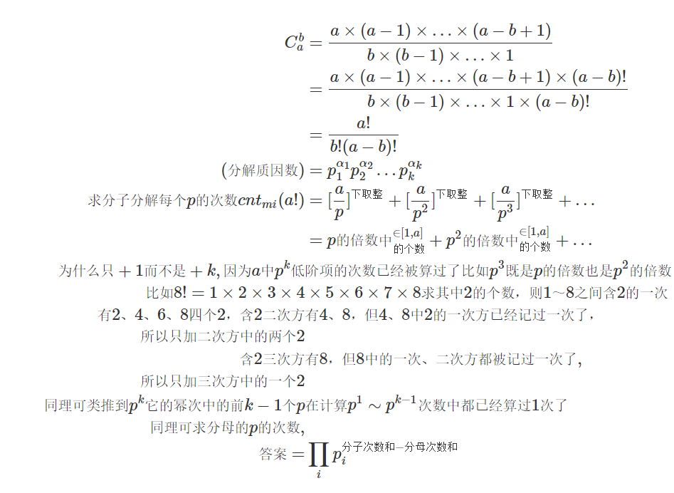

## 题目
输入 a,b，求 $C^b_a$ 的值。

注意结果可能很大，需要使用高精度计算。

## 输入格式
共一行，包含两个整数 a 和 b。

## 输出格式
共一行，输出 $C^b_a$ 的值。

## 数据范围
$1≤b≤a≤5000$

## 样例
```c++
输入样例：
5 3
输出样例：
10
```

## 分析

- 具体:
  筛素数(1~5000)
  求每个质数的次数
  用高精度乘把所有质因子乘上

## 模板
```c++
当我们需要求出组合数的真实值，而非对某个数的余数时，分解质因数的方式比较好用：
    1. 筛法求出范围内的所有质数
    2. 通过 C(a, b) = a! / b! / (a - b)! 这个公式求出每个质因子的次数。 n! 中p的次数是 n / p + n / p^2 + n / p^3 + ...
    3. 用高精度乘法将所有质因子相乘

int primes[N], cnt;     // 存储所有质数
int sum[N];     // 存储每个质数的次数
bool st[N];     // 存储每个数是否已被筛掉


void get_primes(int n)      // 线性筛法求素数
{
    for (int i = 2; i <= n; i ++ )
    {
        if (!st[i]) primes[cnt ++ ] = i;
        for (int j = 0; primes[j] <= n / i; j ++ )
        {
            st[primes[j] * i] = true;
            if (i % primes[j] == 0) break;
        }
    }
}


int get(int n, int p)       // 求n！中的次数
{
    int res = 0;
    while (n)
    {
        res += n / p;
        n /= p;
    }
    return res;
}


vector<int> mul(vector<int> a, int b)       // 高精度乘低精度模板
{
    vector<int> c;
    int t = 0;
    for (int i = 0; i < a.size(); i ++ )
    {
        t += a[i] * b;
        c.push_back(t % 10);
        t /= 10;
    }

    while (t)
    {
        c.push_back(t % 10);
        t /= 10;
    }

    return c;
}

get_primes(a);  // 预处理范围内的所有质数

for (int i = 0; i < cnt; i ++ )     // 求每个质因数的次数
{
    int p = primes[i];
    sum[i] = get(a, p) - get(b, p) - get(a - b, p);
}

vector<int> res;
res.push_back(1);

for (int i = 0; i < cnt; i ++ )     // 用高精度乘法将所有质因子相乘
    for (int j = 0; j < sum[i]; j ++ )
        res = mul(res, primes[i]);
```

## 解答
```c++
#include<iostream>
#include<algorithm>
#include<vector>

using namespace std;

const int N=5010;

int primes[N],cnt;
int sum[N];
bool st[N];

void get_primes(int n)
{
    for(int i=2;i<=n;i++)
    {
        if(!st[i])primes[cnt++]=i;
        for(int j=0;primes[j]*i<=n;j++)
        {
            st[primes[j]*i]=true;
            if(i%primes[j]==0)break;//==0每次漏
        }
    }
}
// 对p的各个<=a的次数算整除下取整倍数
int get(int n,int p)
{
    int res =0;
    while(n)
    {
        res+=n/p;
        n/=p;
    }
    return res;
}
//高精度乘
vector<int> mul(vector<int> a, int b)
{
    vector<int> c;
    int t = 0;
    for (int i = 0; i < a.size(); i ++ )
    {
        t += a[i] * b;
        c.push_back(t % 10);
        t /= 10;
    }
    while (t)
    {
        c.push_back(t % 10);
        t /= 10;
    }
    // while(C.size()>1 && C.back()==0) C.pop_back();//考虑b==0时才有pop多余的0 b!=0不需要这行
    return c;
}

int main()
{
    int a,b;
    cin >> a >> b;
    get_primes(a);

    for(int i=0;i<cnt;i++)
    {
        int p = primes[i];
        sum[i] = get(a,p)-get(a-b,p)-get(b,p);//是a-b不是b-a
    }

    vector<int> res;
    res.push_back(1);

    for (int i = 0; i < cnt; i ++ )
        for (int j = 0; j < sum[i]; j ++ )//primes[i]的次数
            res = mul(res, primes[i]);

    for (int i = res.size() - 1; i >= 0; i -- ) printf("%d", res[i]);
    puts("");

    return 0;
}
```