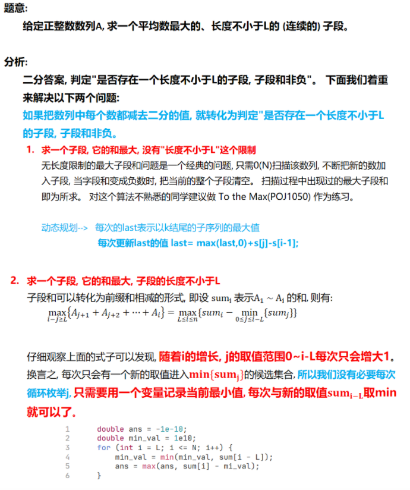

## **题目**
农夫约翰的农场由 N 块田地组成，每块地里都有一定数量的牛，其数量不会少于 1 头，也不会超过 2000 头。

约翰希望用围栏将一部分连续的田地围起来，并使得围起来的区域内每块地包含的牛的数量的平均值达到最大。

围起区域内至少需要包含 F 块地，其中 F 会在输入中给出。

在给定条件下，计算围起区域内每块地包含的牛的数量的平均值可能的最大值是多少。

## **输入格式**
第一行输入整数 N 和 F，数据间用空格隔开。

接下来 N 行，每行输入一个整数，第 i+1 行输入的整数代表第 i 片区域内包含的牛的数目。

## **输出格式**
输出一个整数，表示平均值的最大值乘以 1000 再 向下取整 之后得到的结果。

## **数据范围**
$1≤N≤100000$
$1≤F≤N$

## **样例**
```c++
输入样例：
10 6
6 
4
2
10
3
8
5
9
4
1

输出样例：
6500
```

## **分析**

## **解答**
```c++
#include <iostream>
#include <cstring>
#include <algorithm>

using namespace std;

const int N = 1e5+10;
const double eps = 1e-5;

double c[N],s[N];

int n,f;

bool check(double avg){
    double s[n+1];
    for (int i = 1; i <= n; i ++ ) s[i]=s[i-1]+c[i]-avg;
    
    double minl=2000;//找出s中最小的s[i],那么s[j]-s[i]就可以保持递增
    for(int i=0,j=f;j<=n;j++,i++){
        minl=min(minl,s[i]);
        
        if(s[j]-minl>=0) return 1;
    }
    return 0;
}

double search(double l,double r){
    while(r-l>eps){
        double mid=(l+r)/2;
        if(check(mid)) l=mid;//如果每块地包含的牛的数量的平均值可能的最大值是大于mid的，那么mid如果更小也会是成立的
        else r=mid;//实数二分中值会取到小数，如果直接+1的话会漏掉一些值
    }
    return r;//l必然比r要小，那么l和r都向下取整的话,l的结果可能比r要小1,而错失正确答案
}

int main()
{
    cin>>n>>f;
    
    double l=2000,r=1;
    for (int i = 1; i <= n; i ++ ){
        cin>>c[i];
        l=min(l,c[i]),r=max(r,c[i]);//开始就找出l和r的边界，避免后面更多的二分
    }
    
    double ans=search(l,r);
    cout<<int(ans*1000)<<endl;
    return 0;
}
```