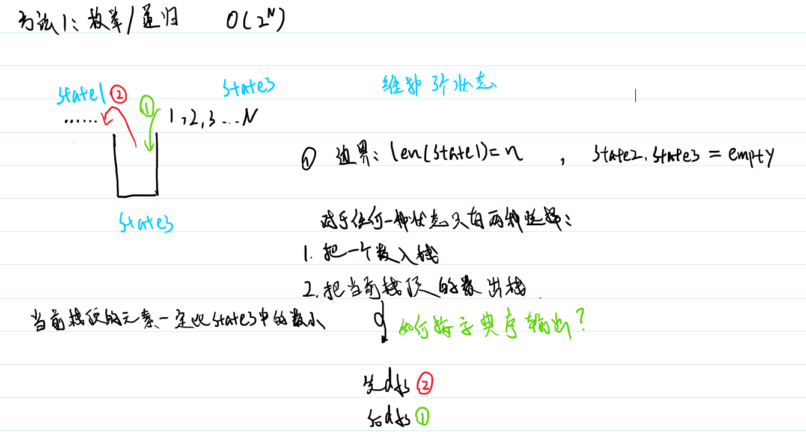

## **题目**
这里有 n 列火车将要进站再出站，但是，每列火车只有 1 节，那就是车头。

这 n 列火车按 1 到 n 的顺序从东方左转进站，这个车站是南北方向的，它虽然无限长，只可惜是一个死胡同，而且站台只有一条股道，火车只能倒着从西方出去，而且每列火车必须进站，先进后出。

也就是说这个火车站其实就相当于一个栈，每次可以让右侧头火车进栈，或者让栈顶火车出站。

车站示意如图：
```c++
            出站<——    <——进站
                     |车|
                     |站|
                     |__|
```
现在请你按《字典序》输出前 20 种可能的出栈方案。

## **输入格式**
输入一个整数 n，代表火车数量。

## **输出格式**
按照《字典序》输出前 20 种答案，每行一种，不要空格。

## **数据范围**
$1≤n≤20$

## **样例**
```c++
输入样例：
3
输出样例：
123
132
213
231
321
```
`难度：简单`

`时/空限制：1s / 64MB`

## **分析**

[来自Bug-Free](https://www.acwing.com/solution/content/27189/)
  
## **解答**
```c++
#include <iostream>
#include <cstring>
#include <algorithm>

using namespace std;

const int N = 25;

int stk[N],tt=-1,num=0;
//stk[i]站台栈
//栈里空的就是tt=-1
//有num条记录
int t[N],idx=-1;
//出栈的序列
//没有出栈就是-1

int n;

void dfs(int u){
    if(u==n+1){//所有车都入栈过
        if(++num>20) exit(0);//输出前20条记录
        for (int i = 0; i <= idx; i ++ )
            printf("%d",t[i]);//输出已经出栈的
        for (int i = tt; i>=0; i -- )
            printf("%d",stk[i]);//输出剩余的
        puts("");//换行
        return;
    }
    
    if(tt!=-1){//如果栈里有车,就可以尝试出栈
        t[++idx]=stk[tt--];//栈尾元素出栈保存
        dfs(u);//再尝试u号车入栈，这个地方就是序列123的出处
        stk[++tt]=t[idx--];//还原
    }
    
    stk[++tt]=u;//u号车入栈
    dfs(u+1);//尝试u+1号车，这里是序列321的出处
    tt--;//还原
}

int main()
{
    scanf("%d", &n);
    dfs(1);
    return 0;
}
```