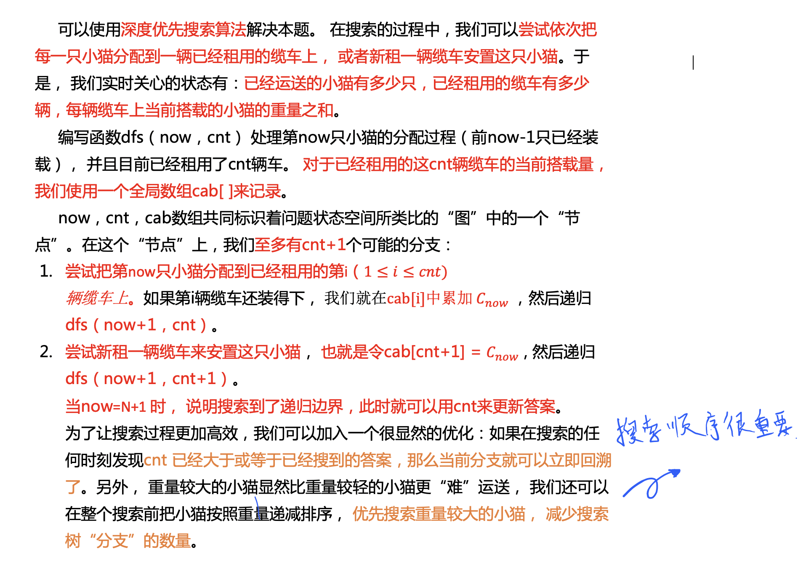

## **题目**
翰翰和达达饲养了 N 只小猫，这天，小猫们要去爬山。

经历了千辛万苦，小猫们终于爬上了山顶，但是疲倦的它们再也不想徒步走下山了（呜咕>_<）。

翰翰和达达只好花钱让它们坐索道下山。

索道上的缆车最大承重量为 W，而 N 只小猫的重量分别是 $C_1、C_2……C_N$。

当然，每辆缆车上的小猫的重量之和不能超过 W。

每租用一辆缆车，翰翰和达达就要付 1 美元，所以他们想知道，最少需要付多少美元才能把这 N 只小猫都运送下山？

## **输入格式**
第 1 行：包含两个用空格隔开的整数，N 和 W。

第 2..N+1 行：每行一个整数，其中第 i+1 行的整数表示第 i 只小猫的重量 $C_i$。

## **输出格式**
输出一个整数，表示最少需要多少美元，也就是最少需要多少辆缆车。

## **数据范围**
$1≤N≤18,$

$1≤C_i≤W≤10^8$

## **样例**
```c++
输入样例
5 1996
1
2
1994
12
29

输出样例：
2
```

## **分析**


[来自  Bug-Free](https://www.acwing.com/solution/content/32118/)

## **解答**
```c++
#include <iostream>
#include <cstring>
#include <algorithm>

using namespace std;

const int N = 20;

int c[N],sum[N];
//c[i]是第i只小猫重量为c[i]
//sum[i]是第i个车已经承载的重量为sum[i]
int ans=N,n,w;

void dfs(int u,int k){//第u只猫,第k个车
    if(k>=ans) return;//如果当前的决策产生的车不能让答案更小的话，就放弃对这个决策更深一层的计算
    if(u==n){//如果小猫遍历完了，就把答案更新
        ans=k;//能到这一步，那么k肯定是比ans要小的
        return;
    }
    for (int i = 0; i < k; i ++ ){//遍历所有车的状态
        if(sum[i]+c[u]<=w){//如果这辆车可以放得下
            sum[i]+=c[u];//就把小猫放进去
            dfs(u+1,k);//再尝试在这k辆车里放入下一只小猫
            sum[i]-=c[u];//恢复
        }
    }
    
    sum[k]=c[u];//别管之前有没有车能放下小猫u，都要再租一辆来放她，因为dfs就是要把所有情况算到
    dfs(u+1,k+1);//再尝试在这k+1辆车里放入下一只小猫
    sum[k]=0;//恢复
}

int main()
{
    scanf("%d%d", &n, &w);

    for (int i = 0; i < n; i ++ )
        cin>>c[i];
    
    //放猫到车里的时候优先放比较重的猫，因为有重猫在下一次放猫的时候选择更少
    sort(c,c+n,greater<int>());
    
    dfs(0,0);
    
    printf("%d",ans);
    
    return 0;
}
```