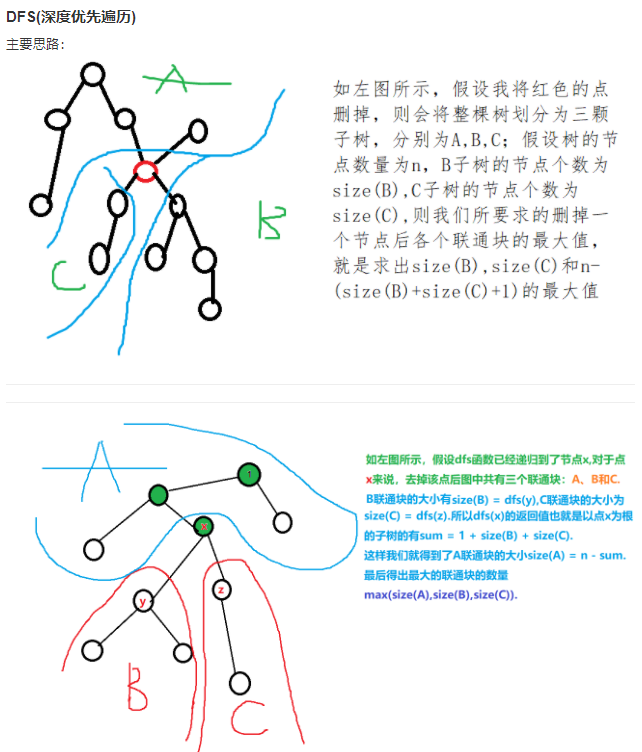

## **题目描述**

给定一颗树，树中包含n个结点（编号1~n）和n-1条无向边。

请你找到树的重心，并输出将重心删除后，剩余各个连通块中点数的最大值。

重心定义：重心是指树中的一个结点，如果将这个点删除后，剩余各个连通块中点数的最大值最小，那么这个节点被称为树的重心。

## **输入格式**

第一行包含整数n，表示树的结点数。

接下来n-1行，每行包含两个整数a和b，表示点a和点b之间存在一条边。

## **输出格式**

输出一个整数m，表示将重心删除后，剩余各个连通块中点数的最大值。

## **数据范围**

$1≤n≤10^5$

## **输入样例**
```c++
9
1 2
1 7
1 4
2 8
2 5
4 3
3 9
4 6
```

## **输出样例**
```c++
4
```

## **分析**


## **模板**
### **树与图的存储**
树是一种特殊的图，与图的存储方式相同。
对于无向图中的边ab，存储两条有向边`a->b, b->a`。
因此我们可以只考虑有向图的存储。

(1)  邻接矩阵：`g[a][b] 存储边a->b`

(2)  邻接表：
```c++
// 对于每个点k，开一个单链表，存储k所有可以走到的点。h[k]存储这个单链表的头结点
int h[N], e[N], ne[N], idx;

// 添加一条边a->b
void add(int a, int b)
{
    e[idx] = b, ne[idx] = h[a], h[a] = idx ++ ;
}

// 初始化
idx = 0;
memset(h, -1, sizeof h);
```

## **树与图的遍历**
时间复杂度 O(n+m), n 表示点数，m 表示边数
(1) 深度优先遍历
```c++
int dfs(int u)
{
    st[u] = true; // st[u] 表示点u已经被遍历过

    for (int i = h[u]; i != -1; i = ne[i])
    {
        int j = e[i];
        if (!st[j]) dfs(j);
    }
}
```

## **解答**
```c++
#include <iostream>
#include <algorithm>
#include <cstring>

using namespace std;

const int N = 1e5 + 10; //数据范围是10的5次方
const int M = 2 * N; //以有向图的格式存储无向图，所以每个节点至多对应2n-2条边

int h[N]; //邻接表存储树，有n个节点，所以需要n个队列头节点
int e[M]; //存储元素
int ne[M]; //存储列表的next值
int idx; //单链表指针
int n; //题目所给的输入，n个节点
int ans = N; //表示重心的所有的子树中，最大的子树的结点数目

bool st[N]; //记录节点是否被访问过，访问过则标记为true

//a所对应的单链表中插入b  a作为根 
void add(int a, int b) {
    e[idx] = b, ne[idx] = h[a], h[a] = idx++;
}

//返回以u为根的子树中节点的个数，包括u节点
int dfs(int u) {
    int res = 0; //存储 删掉某个节点之后，最大的连通子图节点数
    st[u] = true; //标记访问过u节点
    int sum = 1; //存储 以u为根的树 的节点数, 包括u，如图中的4号节点

    //访问u的每个子节点
    for (int i = h[u]; i != -1; i = ne[i]) {
        int j = e[i];
        //因为每个节点的编号都是不一样的，所以 用编号为下标 来标记是否被访问过
        if (!st[j]) {
            int s = dfs(j);  // u节点的单棵子树节点数 如图中的size值
            res = max(res, s); // 记录最大联通子图的节点数
            sum += s; //以j为根的树 的节点数
        }
    }

    //n-sum 如图中的n-size值，不包括根节点4；
    res = max(res, n - sum); // 选择u节点为重心，最大的 连通子图节点数
    ans = min(res, ans); //遍历过的假设重心中，最小的最大联通子图的 节点数
    return sum;
}

int main() {
    memset(h, -1, sizeof h); //初始化h数组 -1表示尾节点
    cin >> n; //表示树的结点数

    // 题目接下来会输入，n-1行数据，
    // 树中是不存在环的，对于有n个节点的树，必定是n-1条边
    for (int i = 0; i < n - 1; i++) {
        int a, b;
        cin >> a >> b;
        add(a, b), add(b, a); //无向图
    }

    dfs(1); //可以任意选定一个节点开始 u<=n

    cout << ans << endl;

    return 0;
}
```

### 
*/

