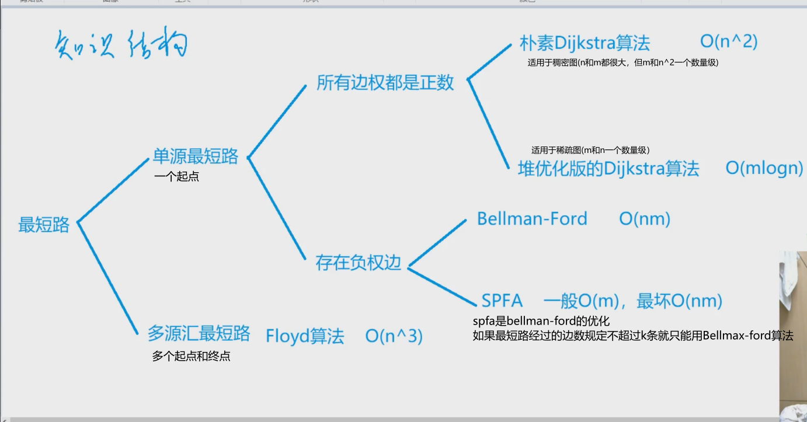
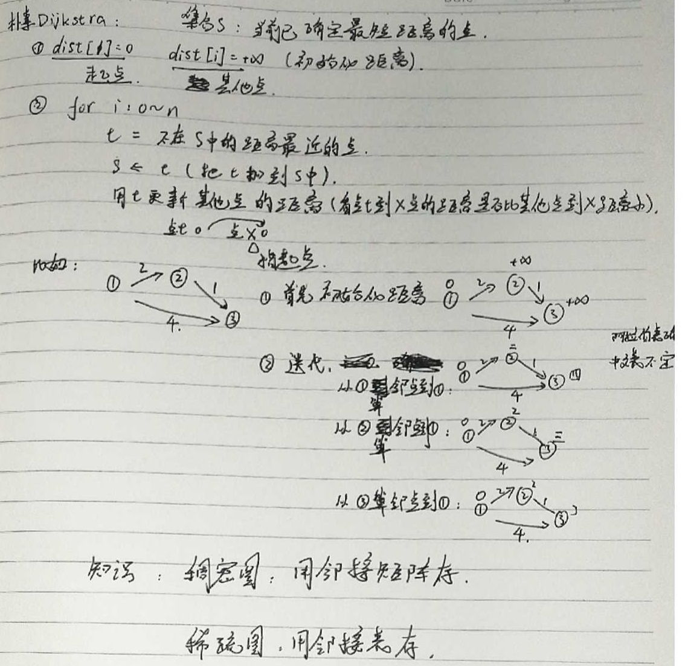
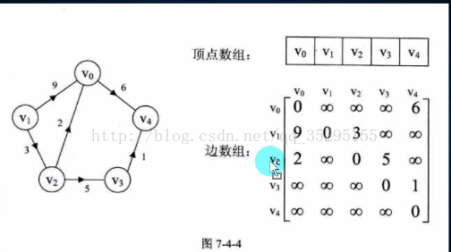

## **题目**
给定一个 n 个点 m 条边的有向图，图中可能存在重边和自环，所有边权均为正值。

请你求出 1 号点到 n 号点的最短距离，如果无法从 1 号点走到 n 号点，则输出 −1。

## **输入格式**
第一行包含整数 n 和 m。

接下来 m 行每行包含三个整数 x,y,z，表示存在一条从点 x 到点 y 的有向边，边长为 z。

## **输出格式**
输出一个整数，表示 1 号点到 n 号点的最短距离。

如果路径不存在，则输出 −1。

## **数据范围**
$1≤n≤500,$
$1≤m≤10^5,$
图中涉及边长均不超过10000。

## **样例**
```c++
输入样例：
3 3
1 2 2
2 3 1
1 3 4

输出样例：
3
```
## **分析**




## **模板**
```c++
朴素dijkstra
时间复杂是 O(n2+m), n 表示点数，m 表示边数
int g[N][N];  // 存储每条边
int dist[N];  // 存储1号点到每个点的最短距离
bool st[N];   // 存储每个点的最短路是否已经确定

// 求1号点到n号点的最短路，如果不存在则返回-1
int dijkstra()
{
    memset(dist, 0x3f, sizeof dist);
    dist[1] = 0;

    for (int i = 0; i < n - 1; i ++ )
    {
        int t = -1;     // 在还未确定最短路的点中，寻找距离最小的点
        for (int j = 1; j <= n; j ++ )
            if (!st[j] && (t == -1 || dist[t] > dist[j]))
                t = j;

        // 用t更新其他点的距离
        for (int j = 1; j <= n; j ++ )
            dist[j] = min(dist[j], dist[t] + g[t][j]);

        st[t] = true;
    }

    if (dist[n] == 0x3f3f3f3f) return -1;
    return dist[n];
}
```

## **解答**
```c++
#include <iostream>
#include <cstring>
#include <algorithm>

using namespace std;

const int N = 510;

int g[N][N];//邻接矩阵
bool st[N];//访问过没
int s[N];//确定了最短距离的点
int d[N];//距离集合

int n,m;//n个点,m个边

int Dijkstra(){
    memset(d,0x3f,sizeof d);//把距离初始化成无穷
    d[1]=0;//起点到起点的距离是0
    
    for (int i = 0; i < n; i ++ ){
        int t=-1;//找出不在s中的距离搜寻起点最近的点
        for (int j = 1; j <= n; j ++ ){
            if(!st[j]&&(t==-1||d[t]>d[j])){
                t=j;
            }
        }
        
        st[t]=true;//t这个点标记成找过了
        
        //用t来更新其他点到起点的距离
        for (int j = 1; j <= n; j ++ ){
            d[j]=min(d[j],d[t]+g[t][j]);
        }
    }
    
    if(d[n]==0x3f3f3f3f) return -1;//如果找不到路径从起点到终点的话
    return d[n];
}

int main()
{
    memset(g,0x3f,sizeof g);
    
    scanf("%d%d", &n, &m);
    
    for (int i = 0; i < m; i ++ ){
        int a,b,c;//a到b的距离是c
        scanf("%d%d%d", &a, &b,&c);
        g[a][b]=min(g[a][b],c);//可能有重边，取权值最小的
    }
    printf("%d",Dijkstra());
    return 0;
} 
```