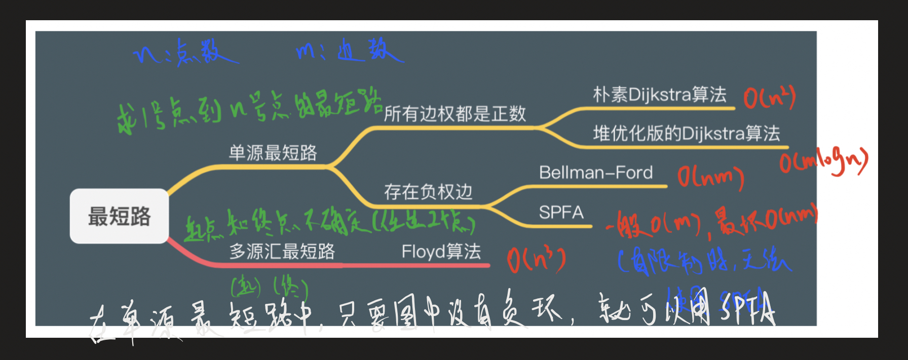
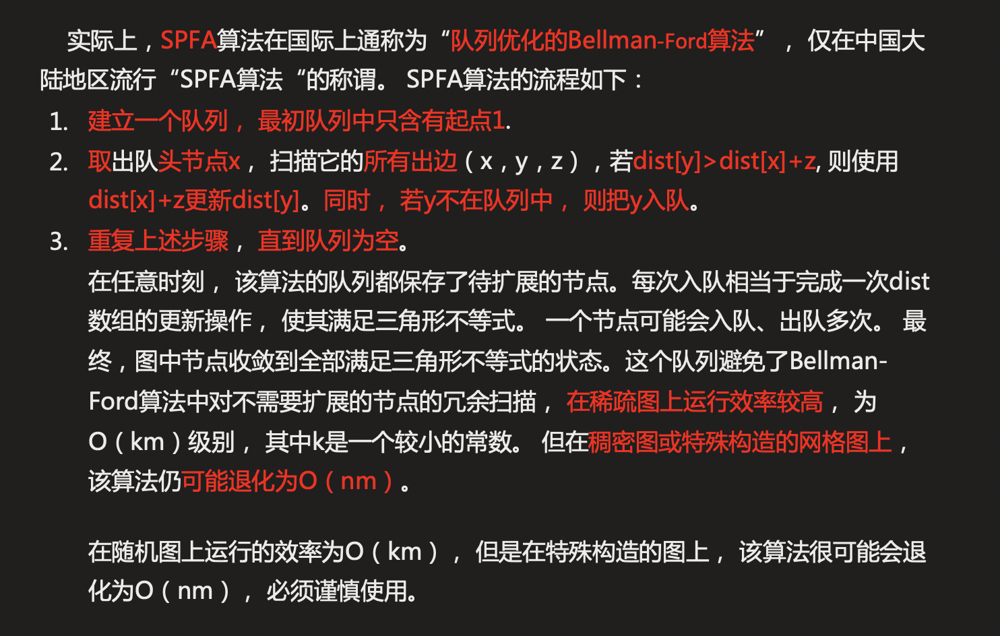

## **题目**
给定一个 n 个点 m 条边的有向图，图中可能存在重边和自环， 边权可能为负数。

请你求出 1 号点到 n 号点的最短距离，如果无法从 1 号点走到 n 号点，则输出 impossible。

数据保证不存在负权回路。

## **输入格式**
第一行包含整数 n 和 m。

接下来 m 行每行包含三个整数 x,y,z，表示存在一条从点 x 到点 y 的有向边，边长为 z。

## **输出格式**
输出一个整数，表示 1 号点到 n 号点的最短距离。

如果路径不存在，则输出 impossible。

## **数据范围**
$1≤n,m≤10^5,$
图中涉及边长绝对值均不超过 10000。

## **样例**
```c++
输入样例：
3 3
1 2 5
2 3 -3
1 3 4

输出样例：
2
```

## **分析**




## **模板**
```c++
时间复杂度 平均情况下 O(m)O(m)，最坏情况下 O(nm)O(nm), nn 表示点数，mm 表示边数
int n;      // 总点数
int h[N], w[N], e[N], ne[N], idx;       // 邻接表存储所有边
int dist[N];        // 存储每个点到1号点的最短距离
bool st[N];     // 存储每个点是否在队列中

// 求1号点到n号点的最短路距离，如果从1号点无法走到n号点则返回-1
int spfa()
{
    memset(dist, 0x3f, sizeof dist);
    dist[1] = 0;

    queue<int> q;
    q.push(1);
    st[1] = true;

    while (q.size())
    {
        auto t = q.front();
        q.pop();

        st[t] = false;//从队列中取出来之后该节点st被标记为false,代表之后该节点如果发生更新可再次入队

        for (int i = h[t]; i != -1; i = ne[i])
        {
            int j = e[i];
            if (dist[j] > dist[t] + w[i])
            {
                dist[j] = dist[t] + w[i];
                if (!st[j])     // 如果队列中已存在j，则不需要将j重复插入
                {
                    q.push(j);
                    st[j] = true;
                }
            }
        }
    }

    if (dist[n] == 0x3f3f3f3f) return -1;
    return dist[n];
}
```

## **解答**
```c++
#include <iostream>
#include <cstring>
#include <algorithm>
#include <queue>

using namespace std;

const int N = 1e5+10,INF=0x3f3f3f3f;

int h[N],e[N],w[N],ne[N],idx=0;
int d[N];
bool st[N];

int n,m;

void add(int a,int b,int c){
    e[idx]=b,w[idx]=c,ne[idx]=h[a],h[a]=idx++;
}

int spfa(){
    memset(d,0x3f,sizeof d);
    d[1]=0;
    
    queue<int> q;
    q.push(1);
    st[1]=true;
    
    while(q.size()){
        auto t=q.front();
        q.pop();
        
        st[t]=false;
        
        for (int i = h[t]; i != -1; i = ne[i] ){
            int j=e[i];
            if(d[j]>d[t]+w[i]){//这个地方可以防止非负权回路,因为绕了一圈后的路径长度一定比不绕一圈的长
                d[j]=d[t]+w[i];
                if(!st[j]){
                    q.push(j);
                    st[j]=true;
                }
            }
        }
    }
    
    if(d[n]>=0x3f3f3f3f) return INF;
    
    return d[n];
}

int main()
{
    scanf("%d%d", &n, &m);
    
    memset(h, -1, sizeof h);
    
    for (int i = 0; i < m; i ++ ){
        int a,b,c;
        scanf("%d%d%d", &a, &b,&c);
        add(a, b, c);
    }
    
    int ans=spfa();
    
    if(ans==INF) printf("impossible");
    else printf("%d",ans);
    
    return 0;
}
```