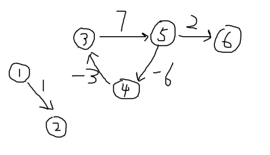

## **题目描述**
给定一个n个点m条边的有向图，图中可能存在重边和自环， 边权可能为负数。

请你判断图中是否存在负权回路。

## **输入格式**
第一行包含整数n和m。

接下来m行每行包含三个整数x，y，z，表示存在一条从点x到点y的有向边，边长为z。

## **输出格式**
如果图中存在负权回路，则输出“Yes”，否则输出“No”。

## **数据范围**
$1≤n≤2000,$
$1≤m≤10000,$
图中涉及边长绝对值均不超过10000。

## **样例**
```c++
输入样例：
3 3
1 2 -1
2 3 4
3 1 -4

输出样例：
Yes
```

## **分析**
### **算法分析**
使用spfa算法解决是否存在负环问题

求负环的常用方法，基于SPFA，一般都用方法 2（该题也是用方法2）：

方法 1：统计每个点入队的次数，如果某个点入队n次，则说明存在负环
方法 2：统计当前每个点的最短路中所包含的边数，如果某点的最短路所包含的边数大于等于n，则也说明存在环

### **y总的原话**
每次做一遍spfa()一定是正确的，但时间复杂度较高，可能会超时。初始时将所有点插入队列中可以按如下方式理解：
在原图的基础上新建一个虚拟源点，从该点向其他所有点连一条权值为0的有向边。那么原图有负环等价于新图有负环。此时在新图上做spfa，将虚拟源点加入队列中。然后进行spfa的第一次迭代，这时会将所有点的距离更新并将所有点插入队列中。执行到这一步，就等价于视频中的做法了。那么视频中的做法可以找到负环，等价于这次spfa可以找到负环，等价于新图有负环，等价于原图有负环。得证。

1. dist[x] 记录虚拟源点到x的最短距离

2. cnt[x] 记录当前x点到虚拟源点最短路的边数，初始每个点到虚拟源点的距离为0，只要他能再走n步，即cnt[x] >= n，则表示该图中一定存在负环，由于从虚拟源点到x至少经过n条边时，则说明图中至少有n + 1个点，表示一定有点是重复使用

3. 若dist[j] > dist[t] + w[i],则表示从t点走到j点能够让权值变少，因此进行对该点j进行更新，并且对应cnt[j] = cnt[t] + 1,往前走一步

注意：该题是判断是否存在负环，并非判断是否存在从1开始的负环，因此需要将所有的点都加入队列中，更新周围的点



## **模板**
```c++
时间复杂度是 O(nm)O(nm), nn 表示点数，mm 表示边数
int n;      // 总点数
int h[N], w[N], e[N], ne[N], idx;       // 邻接表存储所有边
int dist[N], cnt[N];        // dist[x]存储1号点到x的最短距离，cnt[x]存储1到x的最短路中经过的点数
bool st[N];     // 存储每个点是否在队列中

// 如果存在负环，则返回true，否则返回false。
bool spfa()
{
    // 不需要初始化dist数组
    // 原理：如果某条最短路径上有n个点（除了自己），那么加上自己之后一共有n+1个点，由抽屉原理一定有两个点相同，所以存在环。

    queue<int> q;
    for (int i = 1; i <= n; i ++ )
    {
        q.push(i);
        st[i] = true;
    }

    while (q.size())
    {
        auto t = q.front();
        q.pop();

        st[t] = false;

        for (int i = h[t]; i != -1; i = ne[i])
        {
            int j = e[i];
            if (dist[j] > dist[t] + w[i])
            {
                dist[j] = dist[t] + w[i];
                cnt[j] = cnt[t] + 1;
                if (cnt[j] >= n) return true;       // 如果从1号点到x的最短路中包含至少n个点（不包括自己），则说明存在环
                if (!st[j])
                {
                    q.push(j);
                    st[j] = true;
                }
            }
        }
    }

    return false;
}
```

## **解答**
```c++
#include <cstring>
#include <iostream>
#include <algorithm>
#include <queue>

using namespace std;

typedef pair<int, int> PII;

const int N = 100010;

int n, m;
int h[N], w[N], e[N], ne[N], idx;
int dist[N], cnt[N]; //统计最短路径经过的边数
bool st[N];

void add(int a, int b, int c){
    e[idx] = b, w[idx] = c, ne[idx] = h[a], h[a] = idx ++;
}

int spfa(){
    queue<int> q;
    //1不一定是通过负环到达所有点， 将所有可能的点都加入， 注意:第一次出队的，自己到自己也可能存在负环
    for(int i = 1; i <= n; i ++){
        st[i] = true;
        q.push(i);
    }

    while(q.size()){
        int t = q.front();
        q.pop();

        st[t] = false; //取出的元素不在队列

        for(int i = h[t]; i != -1; i = ne[i]){
            int j = e[i];
            if(dist[j] > dist[t] + w[i]){
                dist[j] = dist[t] + w[i];  //更新距离
                cnt[j] = cnt[t] + 1; //等于之前t的距离加上t -> j的距离

                if(cnt[j] >= n) return true;
                if(!st[j]){ //如果不在队列中
                    q.push(j);
                    st[j] = true;
                }
            }
        }
    }

    return false;
}

int main(){
    scanf("%d%d", &n, &m);

    memset(h, -1, sizeof h);
    while(m --){
        int a, b, c;
        scanf("%d%d%d", &a, &b, &c);
        add(a, b, c);
    }

    if(spfa()) puts("Yes");
    else puts("No");

    return 0;
} 
```