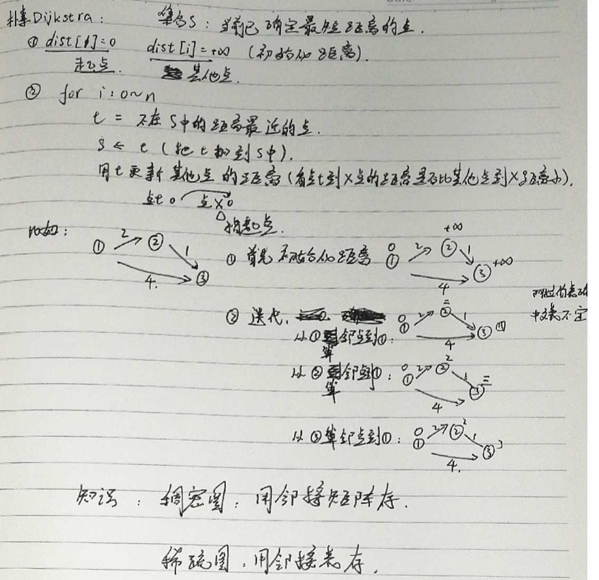

## **题目**
给定一个 n 个点 m 条边的有向图，图中可能存在重边和自环， 边权可能为负数。

请你求出从 1 号点到 n 号点的最多经过 k 条边的最短距离，如果无法从 1 号点走到 n 号点，输出 impossible

注意：图中可能 存在负权回路 。

## **输入格式**
第一行包含三个整数 n,m,k。

接下来 m 行，每行包含三个整数 x,y,z，表示存在一条从点 x 到点 y 的有向边，边长为 z。

## **输出格式**
输出一个整数，表示从 1 号点到 n 号点的最多经过 k 条边的最短距离。

如果不存在满足条件的路径，则输出 。impossible

## **数据范围**
$1≤n,k≤500,$
$1≤m≤10000,$
任意边长的绝对值不超过 10000。

## **样例**
```c++
输入样例：
3 3 1
1 2 1
2 3 1
1 3 3

输出样例：
3
```

## **分析**


## **模板**
```c++
时间复杂度 O(nm), n 表示点数，m 表示边数
注意在模板题中需要对下面的模板稍作修改，加上备份数组，详情见模板题。

int n, m;       // n表示点数，m表示边数
int dist[N];        // dist[x]存储1到x的最短路距离

struct Edge     // 边，a表示出点，b表示入点，w表示边的权重
{
    int a, b, w;
}edges[M];

// 求1到n的最短路距离，如果无法从1走到n，则返回-1。
int bellman_ford()
{
    memset(dist, 0x3f, sizeof dist);
    dist[1] = 0;

    // 如果第n次迭代仍然会松弛三角不等式，就说明存在一条长度是n+1的最短路径，由抽屉原理，路径中至少存在两个相同的点，说明图中存在负权回路。
    for (int i = 0; i < n; i ++ )
    {
        for (int j = 0; j < m; j ++ )
        {
            int a = edges[j].a, b = edges[j].b, w = edges[j].w;
            if (dist[b] > dist[a] + w)
                dist[b] = dist[a] + w;
        }
    }

    if (dist[n] > 0x3f3f3f3f / 2) return -1;
    return dist[n];
}
```

## **解答**
```c++
#include <iostream>
#include <cstring>
#include <algorithm>

using namespace std;

const int M = 1e4+10,N=510,INF=0x3f3f3f3f;

typedef struct{
    int a,b,w;//a到b的权是w
}Edge;

Edge edges[M];//边
int d[N],backup[N];//距离和备份

int n,m,k;

int bellman_ford(){
    memset(d,0x10,sizeof d);
    d[1]=0;
    
    for (int i = 0; i < k; i ++ ){
        memcpy(backup,d,sizeof d);
        for (int i = 0; i < m; i ++ ){
            auto u=edges[i];
            d[u.b]=min(d[u.b],backup[u.a]+u.w);
        }
    }
    
    if(d[n]>1e7) return INF;
    
    return d[n];
}


int main()
{
    scanf("%d%d%d", &n,&m,&k);
    
    for (int i = 0; i < m; i ++ ){
        int a,b,w;
        scanf("%d%d%d", &a, &b,&w);
        edges[i]={a,b,w};
    }
    
    int ans=bellman_ford();
    if(ans==INF) printf("impossible\n");
    else printf("%d\n",ans);
    
    return 0;
}
```