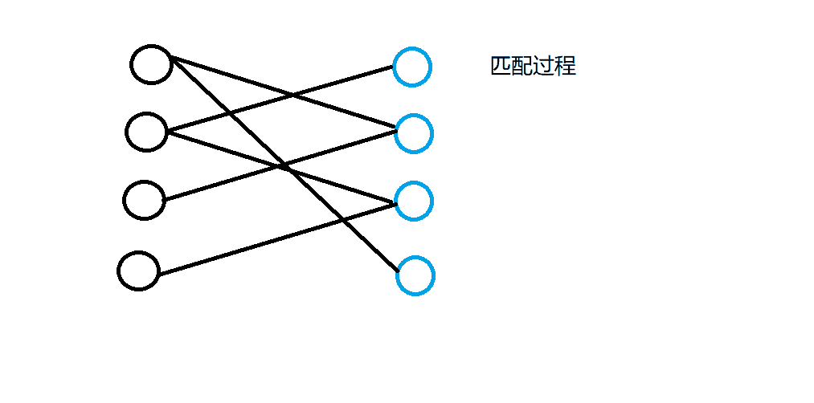

## 题目描述

给定一个二分图，其中左半部包含`n1`个点（编号`1~n1`），右半部包含`n2`个点（编号`1~n2`），二分图共包含m条边。

数据保证任意一条边的两个端点都不可能在同一部分中。

请你求出二分图的最大匹配数。

> 二分图的匹配：给定一个二分图`G`，在`G`的一个子图`M`中，`M`的边集`{E}`中的任意两条边都不依附于同一个顶点，则称`M`是一个匹配。
>
> 二分图的最大匹配：所有匹配中包含边数最多的一组匹配被称为二分图的最大匹配，其边数即为最大匹配数。

## **输入格式**

第一行包含三个整数 n1、n2 和 m。

接下来m行，每行包含两个整数u和v，表示左半部点集中的点u和右半部点集中的点v之间存在一条边。

## **输出格式**

输出一个整数，表示二分图的最大匹配数。

## **数据范围**

$1≤n1,n2≤500,$
$1≤u≤n1,$
$1≤v≤n2,$
$1≤m≤10^5$

## 样例
```c++
输入样例：

2 2 4
1 1
1 2
2 1
2 2

输出样例：

2
```

## 分析
匈牙利算法匹配的主要思想是：
当发生匹配冲突时，看能否解决冲突，能的话就返回true，皆大欢喜；否则就返回false。匹配算法的流程如下图所示：


## 模板
```c++
时间复杂度是 O(nm)O(nm), nn 表示点数，mm 表示边数
int n1, n2;     // n1表示第一个集合中的点数，n2表示第二个集合中的点数
int h[N], e[M], ne[M], idx;     // 邻接表存储所有边，匈牙利算法中只会用到从第一个集合指向第二个集合的边，所以这里只用存一个方向的边
int match[N];       // 存储第二个集合中的每个点当前匹配的第一个集合中的点是哪个
bool st[N];     // 表示第二个集合中的每个点是否已经被遍历过

bool find(int x)
{
    for (int i = h[x]; i != -1; i = ne[i])
    {
        int j = e[i];
        if (!st[j])
        {
            st[j] = true;
            if (match[j] == 0 || find(match[j]))
            {
                match[j] = x;
                return true;
            }
        }
    }

    return false;
}

// 求最大匹配数，依次枚举第一个集合中的每个点能否匹配第二个集合中的点
int res = 0;
for (int i = 1; i <= n1; i ++ )
{
    memset(st, false, sizeof st);
    if (find(i)) res ++ ;
}
```

## 解答
```c++
#include "bits/stdc++.h"

using namespace std;

const int N = 1e5 + 10, M = 2e5 + 10;
int n1, n2, m;              // n1表示第一个集合中的点数，n2表示第二个集合中的点数
int h[N], e[M], ne[M], idx; // 邻接表存储所有边，匈牙利算法中只会用到从第一个集合指向第二个集合的边，所以这里只用存一个方向的边
int match[N];               // 存储第二个集合中的每个点当前匹配的第一个集合中的点是哪个
bool st[N];                 // 表示第二个集合中的每个点是否已经被遍历过

void add(int a, int b)
{
    e[idx] = b, ne[idx] = h[a], h[a] = idx++;
}

bool find(int x)
{
    for (int i = h[x]; i != -1; i = ne[i])
    { //遍历一下x点所在边的另一个点j
        int j = e[i];
        if (!st[j])
        { //如果j还没有找到遍历过
            st[j] = true;
            if (match[j] == 0 || find(match[j]))
            {//如果j还没有找到匹配的点或者j已经匹配好了的点还有其他点可匹配
                match[j]=x;//x和j成功匹配
                return true;
            }
        }
    }
    return false;//x点无法和其所在所有的边上另一个点都无法匹配，那么这个点是无法完成匹配的
}

int main()
{
    memset(h, -1, sizeof h);
    cin >> n1 >> n2 >> m;

    while (m--)
    {
        int a, b;
        cin >> a >> b;
        add(a, b); //说是无向图，但是我们只需要遍历左半图(或者右半图)的点而已
    }

    int res = 0;
    for (int i = 1; i <= n1; i++)
    {                             //遍历左半图
        memset(st, 0, sizeof st); //先清空，表示右半图的点都还没有尝试过
        if (find(i))
            res++; //如果左半图的i点顺利找到了对应的右半图的点，匹配就加一个
    }

    cout << res << endl;
    return 0;
}
```