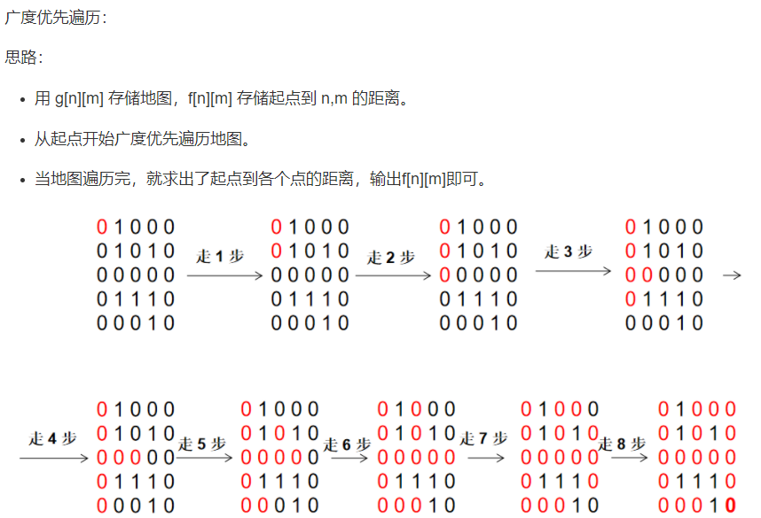

## **题目描述**

给定一个n*m的二维整数数组，用来表示一个迷宫，数组中只包含0或1，其中0表示可以走的路，1表示不可通过的墙壁。

最初，有一个人位于左上角(1, 1)处，已知该人每次可以向上、下、左、右任意一个方向移动一个位置。

请问，该人从左上角移动至右下角(n, m)处，至少需要移动多少次。

数据保证(1, 1)处和(n, m)处的数字为0，且一定至少存在一条通路。

## **输入格式**

第一行包含两个整数n和m。

接下来n行，每行包含m个整数（0或1），表示完整的二维数组迷宫。

## **输出格式**

输出一个整数，表示从左上角移动至右下角的最少移动次数。

## **数据范围**

$1≤n,m≤100$

## **输入样例**
```c++
5 5
0 1 0 0 0
0 1 0 1 0
0 0 0 0 0
0 1 1 1 0
0 0 0 1 0
```

## **输出样例**
```c++
8
```

## **分析**



## **解答**
### **自己写队列**
```c++
#include "bits/stdc++.h"

using namespace std;

typedef pair<int, int> PII;

const int N = 110;

int g[N][N];  //存储地图
int d[N][N];  //标记搜索到的点的距离
PII q[N * N],pre[N][N]; //自己写队列

int n, m;

int bfs()
{
    memset(d, -1, sizeof d); //距离全为-1表示还没走过

    int hh = 0, tt = 0;
    q[0] = {0, 0}; //把[0,0]点放到队列里作为开始
    d[0][0] = 0;   //走过了

    int dx[4] = {0, 1, 0, -1}, dy[4] = {1, 0, -1, 0};

    while (hh <= tt)
    {                     //队列还没空
        auto u = q[hh++]; //获取队头并且弹出队头
        for (int i = 0; i < 4; i++)
        { //走遍四个方向
            int x = u.first + dx[i], y = u.second + dy[i];
            if (x >= 0 && x < n && y >= 0 && y < m && g[x][y] == 0&&d[x][y]==-1)
            {
                pre[x][y]=u;
                d[x][y] = d[u.first][u.second] + 1;
                q[++tt] = {x, y};
            }
        }
    }
    /*====  遍历最短路径  =======*/
    int x=n-1,y=m-1;
    while(x||y){
        printf("%d %d\n",x,y);
        auto u=pre[x][y];
        x=u.first,y=u.second;
    }
    return d[n-1][m-1];
}

int main()
{
    scanf("%d%d", &n, &m);

    for (int i = 0; i < n; i++)
        for (int j = 0; j < m; j++)
            scanf("%d", &g[i][j]);

    printf("%d", bfs());
    return 0;
}
```

### **STL队列**
```c++
#include "bits/stdc++.h"

using namespace std;

typedef pair<int, int> PII;

const int N = 110;

int g[N][N];  //存储地图
int d[N][N];  //标记搜索到的点的距离

int n, m;

int bfs() {
    queue<PII> q;
    memset(d, -1, sizeof d);
    d[0][0] = 0;
    q.push({0,0});
    while(q.size()) {
        auto t = q.front();
        q.pop();
        for(int i = 0; i < 4; i++) {
            int x = t.first + dx[i], y = t.second + dy[i];
            if(x>=0 && x < n && y>=0 && y < m && g[x][y] == 0 && d[x][y] == -1) {
                d[x][y] = d[t.first][t.second] + 1;
                q.push({x, y});
            }
        }
    }
    return d[n-1][m-1];
}

int main()
{
    scanf("%d%d", &n, &m);

    for (int i = 0; i < n; i++)
        for (int j = 0; j < m; j++)
            scanf("%d", &g[i][j]);

    printf("%d", bfs());
    return 0;
}
```