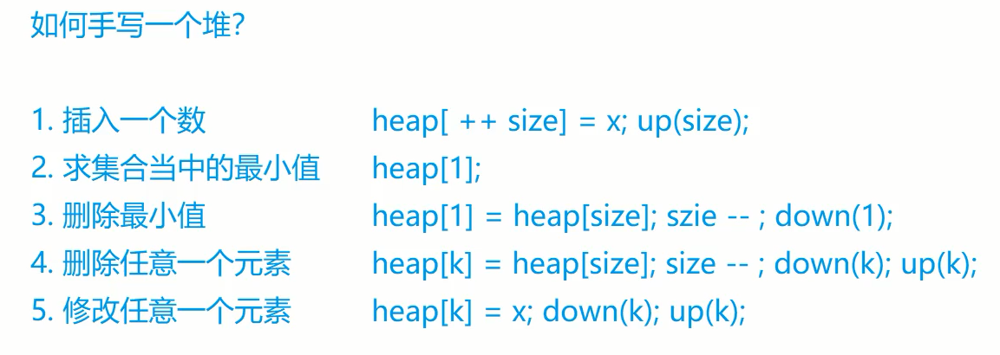

## **题目**
输入一个长度为n的整数数列，从小到大输出前m小的数。

## **输入格式**

第一行包含整数n和m。

第二行包含n个整数，表示整数数列。

## **输出格式**

共一行，包含m个整数，表示整数数列中前m小的数。

## **数据范围**

$1≤m≤n≤10^5$，
$1≤数列中元素≤10^9$

## **输入**
```c++
5 3
4 5 1 3 2
```

## **输出样例**
```c++
1 2 3
```

## **模板**
```c++
void down(int u){
    int t=u;
    if(u*2<=size&&a[t]>a[u*2]) t=u*2;
    if(u*2+1<=size&&a[t]>a[u*2+1]) t=u*2+1;
    if(t!=u){
        swap(a[t],a[u]);
        down(t);
    }
}
```

## **分析**

堆在数组中的关系
- 设顶点下标是u，那么左儿子的下标一定是u*2，右儿子的下标一定是u*2+1.




## **解答**
```c++
#include <bits/stdc++.h>

using namespace std;

const int N = 1e5 + 10;

int a[N], size;

void down(int u){
    int t=u;
    if(u*2<=size&&a[t]>a[u*2]) t=u*2;//左节点存在并且顶点比左儿子大就把顶点换到左儿子的位置
    if(u*2+1<=size&&a[t]>a[u*2+1]) t=u*2+1;//由于是完全二叉树，所以应该右儿子应该大于左儿子
    if(t!=u){
        swap(a[t],a[u]);
        down(t);
    }
}

void up(int u){
    while(u/2&&a[u/2]>a[u]){
        swap(a[u/2],a[u]);
       u/=2; 
    }
}

int main()
{
    int n, m;
    scanf("%d%d", &n, &m);
    size = n;

    for (int i = 1; i <= n; i++)
        scanf("%d", &a[i]);
    
    for(int i=n/2;i>=1;i--)
        down(i);
    
    while (m--)
    {
        printf("%d ", a[1]);
        a[1] = a[size];
        size--;
        down(1);
    }
    
    return 0;
}
```