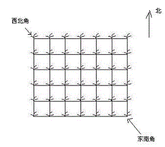
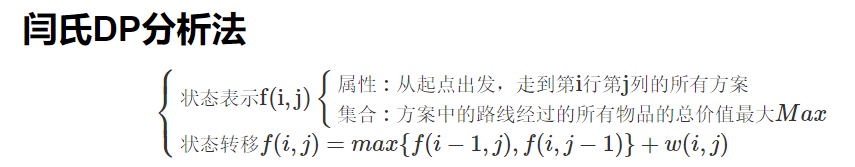
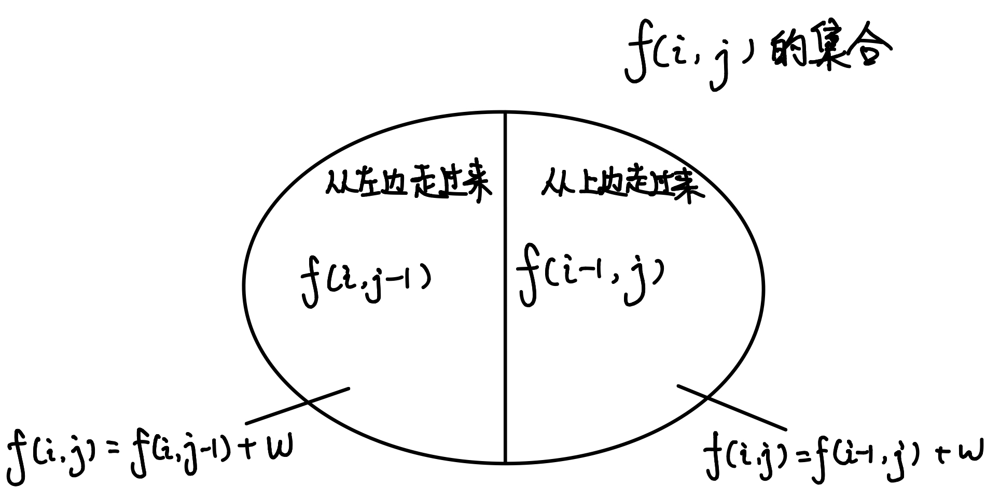

## 题目
`Hello Kitty`想摘点花生送给她喜欢的米老鼠。

她来到一片有网格状道路的矩形花生地(如下图)，从西北角进去，东南角出来。

地里每个道路的交叉点上都有种着一株花生苗，上面有若干颗花生，经过一株花生苗就能摘走该它上面所有的花生。

`Hello Kitty`只能向东或向南走，不能向西或向北走。

问`Hello Kitty`最多能够摘到多少颗花生。



## 输入格式
第一行是一个整数`T`，代表一共有多少组数据。

接下来是`T`组数据。

每组数据的第一行是两个整数，分别代表花生苗的行数R和列数 `C`。

每组数据的接下来R行数据，从北向南依次描述每行花生苗的情况。每行数据有`C`个整数，按从西向东的顺序描述了该行每株花生苗上的花生数目M。

## 输出格式
对每组输入数据，输出一行，内容为Hello Kitty能摘到得最多的花生颗数。

## 数据范围
$1≤T≤100$,
$1≤R,C≤100$,
$0≤M≤1000$

## 样例
```c++
输入样例：
2
2 2
1 1
3 4
2 3
2 3 4
1 6 5
输出样例：
8
16
```

## 分析
这题是一道标准的动态规划问题，模型是**数字三角形**

我们先来分析一下

如果要进行动态规划，则用来表示当前状态的参数有哪些？

- 当前走到第ii行
- 当前走到第jj列

于是乎，我们可以开二维数组`f[i][j]`来存储当前在`i`行`j`列的状态

而`f[i][j]`的值，就是表示从起点走到该点经过的所有格子的价值总和的最大值

则最终答案的状态就是`f[n][m]`

然后再考虑状态转移方程

因为限制了只能向右或向下走，因此当前状态`f[i][j]`只能由`f[i-1][j]`或`f[i][j-1`]转移过来

闫氏DP分析法

集合划分


## 解答
```c++
#include <iostream>
#include <cstring>
#include <algorithm>

using namespace std;

const int N = 110;

int f[N][N];//kt在第i行第j列的时候拥有最多花生的数量
int n,m,t;
int g[N][N];//棋盘

int main()
{
    scanf("%d", &t);
    while(t--)
    {
        scanf("%d%d", &n, &m);
        
        for (int i = 1; i <= n; i ++ )
            for (int j = 1; j <= m; j ++ )
                scanf("%d", &g[i][j]);
                
        for (int i = 1; i <= n; i ++ )
            for (int j = 1; j <= m; j ++ )
                f[i][j]=max(f[i][j-1],f[i-1][j])+g[i][j];
                
        printf("%d\n",f[n][m]);
    }
    
    return 0;
}
```