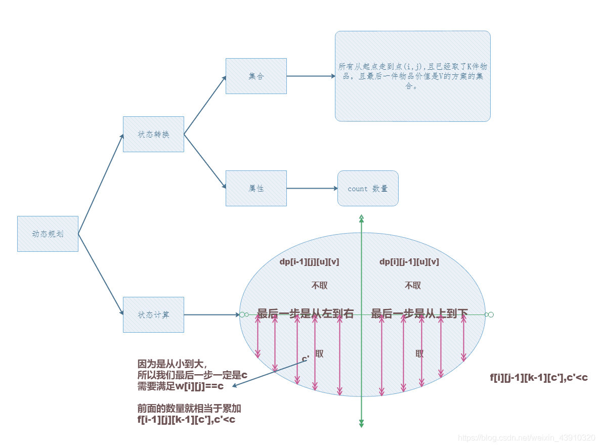

## 题目
`X` 国王有一个地宫宝库，是 `n×m` 个格子的矩阵，每个格子放一件宝贝，每个宝贝贴着价值标签。

地宫的入口在左上角，出口在右下角。

小明被带到地宫的入口，国王要求他只能向右或向下行走。

走过某个格子时，如果那个格子中的宝贝价值比小明手中任意宝贝价值都大，小明就可以拿起它（当然，也可以不拿）。

当小明走到出口时，如果他手中的宝贝恰好是 `k` 件，则这些宝贝就可以送给小明。

请你帮小明算一算，在给定的局面下，他有多少种不同的行动方案能获得这 `k` 件宝贝。

## 输入格式
第一行 `3` 个整数，`n,m,k`，含义见题目描述。

接下来 `n` 行，每行有 `m` 个整数 $C_i$ 用来描述宝库矩阵每个格子的宝贝价值。

## 输出格式
输出一个整数，表示正好取 `k` 个宝贝的行动方案数。

该数字可能很大，输出它对 `1000000007` 取模的结果。

## 数据范围
$1≤n,m≤50,$
$1≤k≤12,$
$0≤C_i≤12$

## 样例
```c++
输入样例1：
2 2 2
1 2
2 1
输出样例1：
2
输入样例2：
2 3 2
1 2 3
2 1 5
输出样例2：
14
```

## 分析


## 解答
```c++
#include <iostream>
#include <cstring>
#include <algorithm>

using namespace std;

const int N = 55,M=55,K=15,C=15,MOD=1000000007;

int n,m,k;//再n*m的棋盘中能拿k个宝贝
int w[N][N];//w[i][j]:坐标(i,j)处的宝贝价值
int f[N][M][K][C];//f[i][j][k][c]:从(0,0)到(i,j)处拿k个物品且最后一个宝贝价值是c而获得的总宝贝价值的最大值

int main()
{
    cin>>n>>m>>k;
    
    for (int i = 1; i <= n; i ++ )
        for (int j = 1; j <= n; j ++ )
        {
            cin>>w[i][j];
            w[i][j]++;//让所有宝贝价值加一，避免f初始化成-1+1(-1的时候就是还没有从棋盘里拿取宝贝)的时候有重复
        }
        
    f[1][1][1][w[1][1]]=1;//如果拿取第一个宝贝
    f[1][1][0][0]=0;//如果不拿取第一个宝贝
    
    for (int i = 1; i <= n; i ++ )
        for (int j = 1; j <= n; j ++ )
        {
            if(i==1&&j==1)//(1,1)已经走过了，不用再走一遍
                continue;
                
            for(int u=0;u<=k;u++)//最多拿k个宝贝
                for(int v=0;v<=13;v++)//最后一个宝贝的价值是<=13的
                {
                    int &val=f[i][j][u][v];
                    val=(val+f[i-1][j][u][v])%MOD;//往下走不取
                    val=(val+f[i][j-1][u][v])%MOD;//往右走不去
                    if(v>0&&v==w[i][j])//从12个数里挑出w[i][j]
                    {
                        for(int c=0;c<v;c++)
                        {
                            val=(val+f[i-1][j][u-1][c])%MOD;//往下走取
                            val=(val+f[i][j-1][u-1][c])%MOD;//往右走取
                        }
                    }
                }
        }
        
    int res=0;
    for (int i = 0; i <= 13; i ++ ) res=(res+=f[n][m][k][i])%MOD;
    
    printf("%d",res);
    
    return 0;
}
```