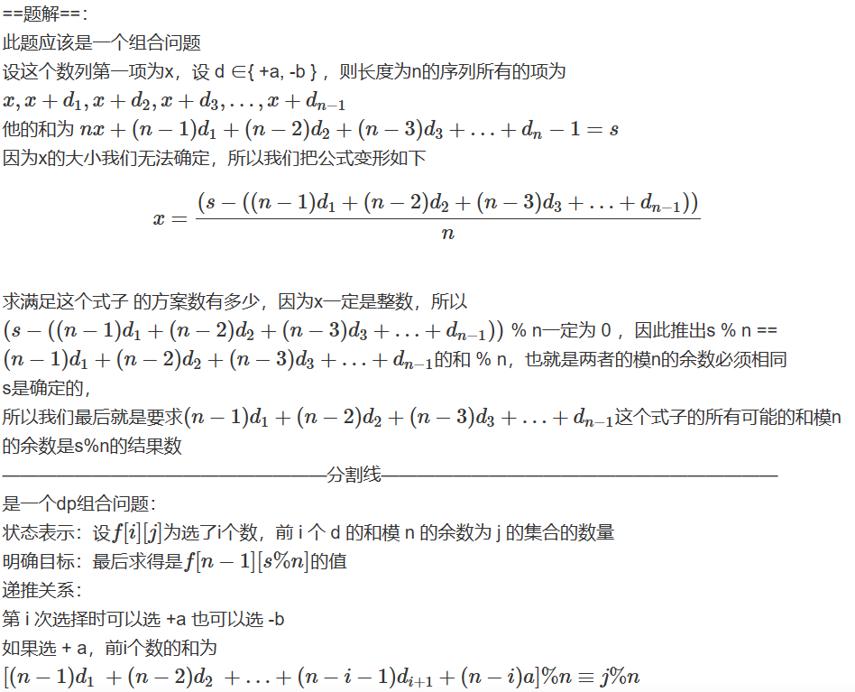
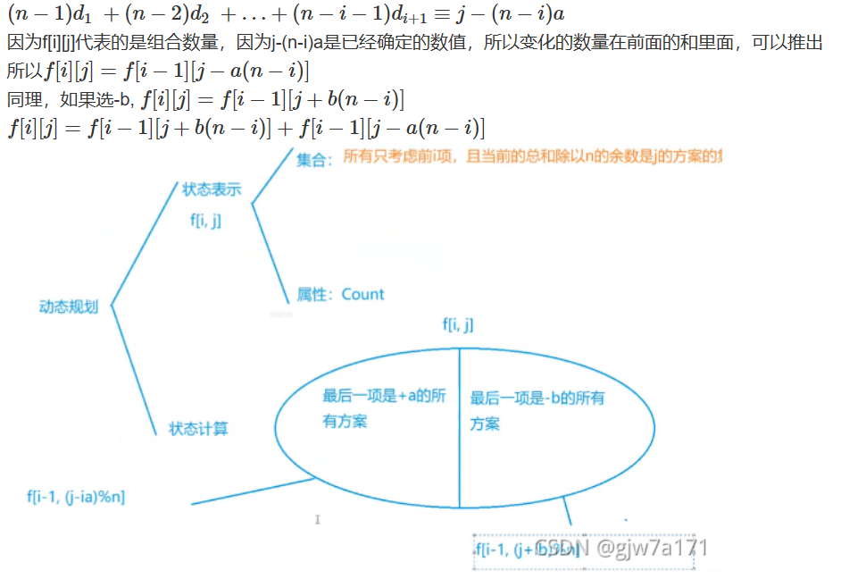

## 题目
观察这个数列：

`1 3 0 2 -1 1 -2 …`

这个数列中后一项总是比前一项增加`2`或者减少`3`，且每一项都为整数。

栋栋对这种数列很好奇，他想知道长度为 `n` 和为 `s` 而且后一项总是比前一项增加 `a` 或者减少 `b` 的整数数列可能有多少种呢？

## 输入格式
共一行，包含四个整数 `n,s,a,b`，含义如前面所述。

## 输出格式
共一行，包含一个整数，表示满足条件的方案数。

由于这个数很大，请输出方案数除以 `100000007` 的余数。

## 数据范围
$1≤n≤1000,$
$−10^9≤s≤10^9,$
$1≤a,b≤10^6$

## 样例
```c++
输入样例：
4 10 2 3
输出样例：
2
样例解释
两个满足条件的数列分别是2 4 1 3和7 4 1 -2。
```

## 分析




## 解答
```c++
#include <iostream>
#include <cstring>
#include <algorithm>

using namespace std;

const int N = 1010,MOD=100000007;

int f[N][N];

int get_mod(int a,int b)//求a除以b的正余数
{
    return ((a%b)+b)%b;
}

int main()
{
    int n,s,a,b;
    cin>>n>>s>>a>>b;
    
    f[0][0]=1;
    for (int i = 1; i <= n; i ++ )
        for (int j = 0; j < n; j ++ )
        {
            f[i][j]=(f[i-1][get_mod(j-a*i,n)]+f[i-1][get_mod(j+b*i,n)])%MOD;
        }
    cout<<f[n-1][get_mod(s,n)]<<endl;
    
    return 0;
}
```