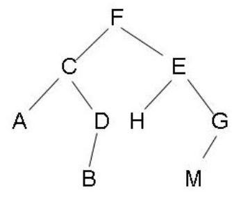

## **题目**
给定一棵二叉树的其中一个节点，请找出中序遍历序列的下一个节点。

注意：

- 如果给定的节点是中序遍历序列的最后一个，则返回空节点;
- 二叉树一定不为空，且给定的节点一定不是空节点；

## **数据范围**
树中节点数量 [0,100]。

## **样例**
假定二叉树是：[2, 1, 3, null, null, null, null]， 给出的是值等于2的节点。

则应返回值等于3的节点。

解释：该二叉树的结构如下，2的后继节点是3。
```c++
  2
 / \
1   3
```

## **分析**
### **算法**

`(模拟) O(h)`

这道题目就是让我们求二叉树中给定节点的后继。

分情况讨论即可，如下图所示：

1. 如果当前节点有右儿子，则右子树中最左侧的节点就是当前节点的后继。比如F的后继是H；
2. 如果当前节点没有右儿子，则需要沿着father域一直向上找，找到第一个是其father左儿子的节点，该节点的father就是当前节点的后继。比如当前节点是D，则第一个满足是其father左儿子的节点是F，则C的father就是D的后继，即F是D的后继。



### **时间复杂度分析**
不论往上找还是往下找，总共遍历的节点数都不大于树的高度。所以时间复杂度是 O(h)，其中 h是树的高度。

## **解答**
```c++
/**
 * Definition for a binary tree node.
 * struct TreeNode {
 *     int val;
 *     TreeNode *left;
 *     TreeNode *right;
 *     TreeNode *father;
 *     TreeNode(int x) : val(x), left(NULL), right(NULL), father(NULL) {}
 * };
 */
class Solution {
public:
    TreeNode* inorderSuccessor(TreeNode* p) {
        if (p->right) {
            p = p->right;
            while (p->left) p = p->left;
            return p;
        }

        while (p->father && p == p->father->right) p = p->father;
        return p->father;
    }
};

```