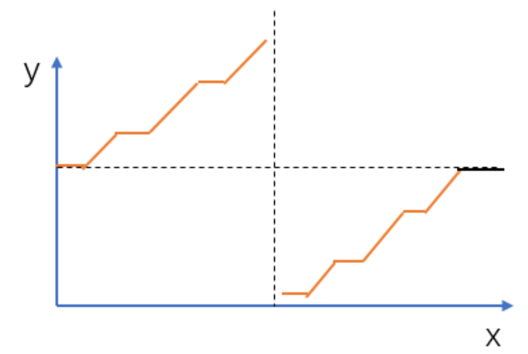

## **题目**
把一个数组最开始的若干个元素搬到数组的末尾，我们称之为数组的旋转。

输入一个升序的数组的一个旋转，输出旋转数组的最小元素。

例如数组 {3,4,5,1,2} 为 {1,2,3,4,5} 的一个旋转，该数组的最小值为 1。

数组可能包含重复项。

注意：数组内所含元素非负，若数组大小为 0，请返回 −1。

## **数据范围**
数组长度 [0,90]。

## **样例**
```c++
输入：nums = [2, 2, 2, 0, 1]

输出：0
```

## **分析**
1.这是数组在一个分界线两端是有序的，而且nums[0]必然是大于等于nums[nums.size()-1]的

2.一看有序数组，那就很有可能有二分法
3.为了保证数组的两端不相等，所以需要先把右端和nums[0]一样的数去除.

## **解答**
```c++
class Solution {
public:
    int findMin(vector<int>& nums) {
        int n = nums.size() - 1;
        if (n < 0) return -1;
        while (n > 0 && nums[n] == nums[0]) n -- ;
        if (nums[n] >= nums[0]) return nums[0];
        int l = 0, r = n;
        while (l < r) {
            int mid = l + r >> 1;       // [l, mid], [mid + 1, r]
            if (nums[mid] < nums[0]) r = mid;
            else l = mid + 1;
        }
        return nums[r];
    }
};
```