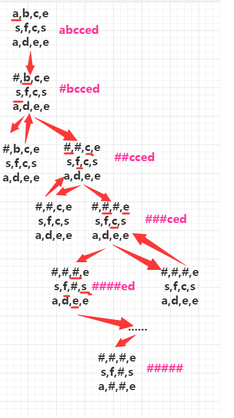

## 题目
请设计一个函数，用来判断在一个矩阵中是否存在一条包含某字符串所有字符的路径。

路径可以从矩阵中的任意一个格子开始，每一步可以在矩阵中向左，向右，向上，向下移动一个格子。

如果一条路径经过了矩阵中的某一个格子，则之后不能再次进入这个格子。

**注意：**
- 输入的路径不为空；
- 所有出现的字符均为大写英文字母；

## 数据范围
矩阵中元素的总个数 [0,900]。
路径字符串的总长度 [0,900]。

## 样例
```c++
matrix=
[
  ["A","B","C","E"],
  ["S","F","C","S"],
  ["A","D","E","E"]
]

str="BCCE" , return "true" 

str="ASAE" , return "false"
```

## 分析
按照Y老师视频的说就是 典型的暴搜例子
我们按照搜索的模板来定义
1. 寻找起始点 （第一个符合条件的字母） ,添加一个同样大小的多维数组 维护该点是否访问过
2. 深度搜索（四个方向扩展）
3. 设置正确的退出点 不符合条件 坐标越界 字符串长度越界等
4. 继续下一轮搜索 记得将访问数组中对应的点恢复原样


## 解答
```c++
class Solution {
public:
    bool hasPath(vector<vector<char>>& matrix, string &str) {
        if(str.size()==0||matrix.size()==0) return false;
        if(matrix[0].size()==0) return false;

        for (int i = 0; i < matrix.size(); i ++ )
            for (int j = 0; j < matrix[0].size(); j ++ )
                if(dfs(i,j,0,matrix,str)) 
                    return true;
        
        return false;        
    }
    
    bool dfs(int i,int j,int u,vector<vector<char>>& matrix, string &str)
    {
        if(matrix[i][j]!=str[u]) return false;
        if(u==str.size()-1) return true;
        
        int dx[4] = {-1, 0, 1, 0}, dy[4] = {0, 1, 0, -1};

        matrix[i][j]+=32;
        for (int k = 0; k < 4; k ++ )
        {
            int a=i+dx[k],b=j+dy[k];
            
            if(a<0||a>=matrix.size()||b<0||b>=matrix[0].size()) continue;
            
            if(dfs(a,b,u+1,matrix,str)) return true;
        }
        matrix[i][j]-=32;
        
        return false;
    }
};
```
