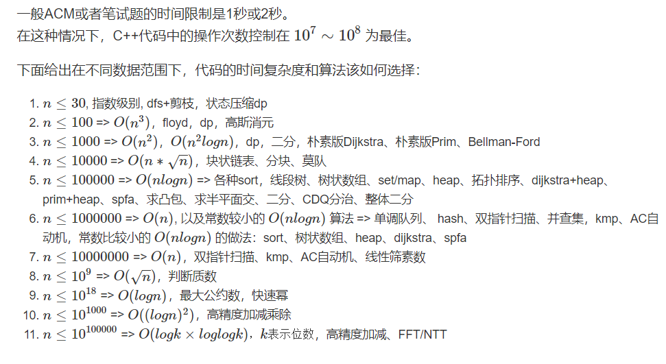

# 算法学习记录
Acwing:基础的学习

LeetCode:对Acwing中学习内容的复习
&nbsp; 
&nbsp;
&nbsp;
## 由数据范围反推算法复杂度以及算法内容


&nbsp; 
&nbsp;
&nbsp;

## 输入输出加速
输入尽量用scanf(),输出尽量用printf(),
如果一定想用cin和cout,那么在程序开头加上
```c++
cin.tie(0);
ios::sync_with_stdio(false);
cout.tie(0);
```
但是加上之后是无法使用printf()和scanf()的。